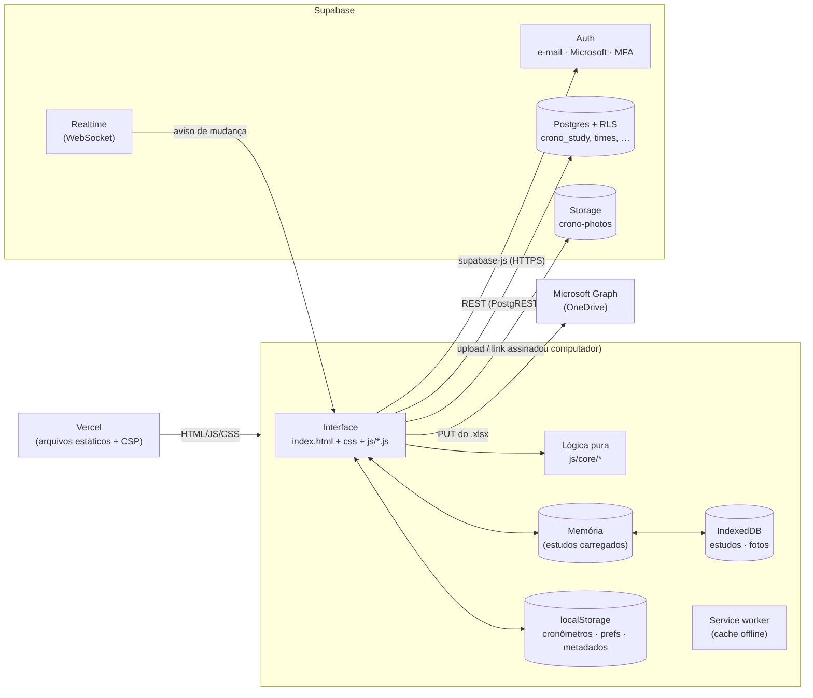
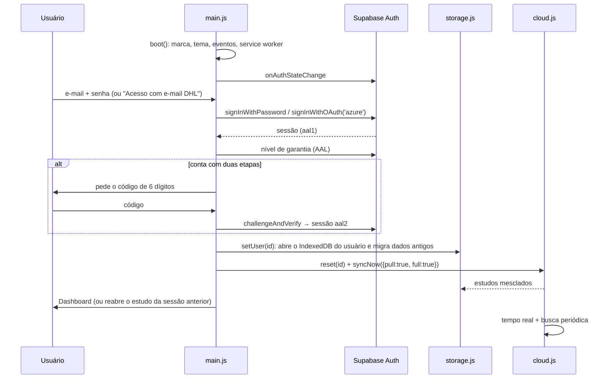
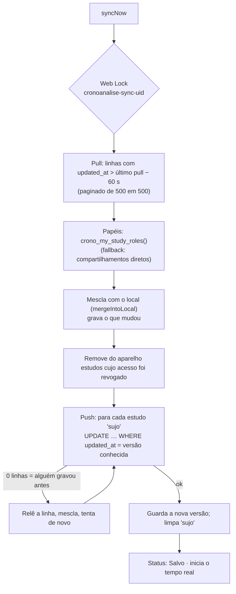

# CronoAnalise System: como funciona e como foi feito

> Documento técnico do **CronoAnalise System** (versão Beta 11).
> Explica a arquitetura, cada funcionalidade, as fórmulas, o banco de dados, a segurança, os testes e a história de construção da ferramenta, etapa por etapa.
>
> **Autor:** Daniel Thomaseto · Para o uso no dia a dia, veja o [Guia de uso](GUIA-DE-USO.md).

---

## Sumário

1. [Visão geral](#1-visão-geral)
2. [Arquitetura](#2-arquitetura)
3. [Mapa dos arquivos](#3-mapa-dos-arquivos)
4. [Ciclo de vida do app](#4-ciclo-de-vida-do-app)
5. [Modelo de dados](#5-modelo-de-dados)
6. [Mesclagem registro a registro](#6-mesclagem-registro-a-registro)
7. [Armazenamento no aparelho](#7-armazenamento-no-aparelho)
8. [Cronômetro](#8-cronômetro)
9. [Indicadores e fórmulas](#9-indicadores-e-fórmulas)
10. [Ritmo Westinghouse por etapa](#10-ritmo-westinghouse-por-etapa)
11. [Tendência do ciclo e curva de aprendizado](#11-tendência-do-ciclo-e-curva-de-aprendizado)
12. [Balanceamento de linha](#12-balanceamento-de-linha)
13. [Amostragem do trabalho](#13-amostragem-do-trabalho)
14. [Gráficos](#14-gráficos)
15. [Sincronização com a nuvem](#15-sincronização-com-a-nuvem)
16. [Banco de dados (Supabase)](#16-banco-de-dados-supabase)
17. [Segurança e LGPD](#17-segurança-e-lgpd)
18. [Equipe: compartilhamento, times e tempo real](#18-equipe-compartilhamento-times-e-tempo-real)
19. [Fotos dos registros](#19-fotos-dos-registros)
20. [Exportações e relatórios](#20-exportações-e-relatórios)
21. [Offline (PWA)](#21-offline-pwa)
22. [Interface, temas e acessibilidade](#22-interface-temas-e-acessibilidade)
23. [Desempenho](#23-desempenho)
24. [Monitoramento de erros e administração](#24-monitoramento-de-erros-e-administração)
25. [Testes e integração contínua](#25-testes-e-integração-contínua)
26. [Como foi feito: a história, etapa por etapa](#26-como-foi-feito-a-história-etapa-por-etapa)
27. [Decisões de projeto](#27-decisões-de-projeto)
28. [Como manter e evoluir](#28-como-manter-e-evoluir)

---

## 1. Visão geral

O CronoAnalise System é uma ferramenta web para **estudo de tempos e métodos** (*cronoanálise*) e **amostragem do trabalho**. Ela substitui o cronômetro de celular com a planilha. Na mesma tela, a pessoa:

1. cadastra as etapas do processo;
2. cronometra cada ciclo tocando na etapa que acabou de terminar;
3. vê os indicadores calculados na hora: produtividade, % de valor agregado, variabilidade, tamanho de amostra, takt, balanceamento, tendência;
4. exporta para Excel, CSV, PDF, A3 ou OneDrive e compartilha com pessoas e times.

Princípios que guiaram o projeto:

| Princípio | Como aparece no código |
|---|---|
| **Funcionar no chão de fábrica** | Offline de verdade (IndexedDB + service worker), Modo Campo com botões grandes, cronômetro que sobrevive a recarregar a página |
| **Nunca perder dado** | Mesclagem registro a registro entre aparelhos, "lápides" para exclusões, versões no servidor, backup JSON |
| **Sem build e sem dependências pesadas** | HTML + CSS + JavaScript puro (módulos ES); gráficos SVG, Excel e ZIP escritos no próprio projeto |
| **Segurança no banco, não só na tela** | Políticas RLS do Postgres decidem quem lê e grava; a interface só reflete isso |
| **Lógica testável** | Tudo que calcula fica em `js/core/`, sem DOM, testado no Node |

---

## 2. Arquitetura



- **Front-end estático.** A Vercel só entrega arquivos e aplica os cabeçalhos de segurança (`vercel.json`). Não existe servidor próprio.
- **Supabase como back-end.** O app usa a biblioteca oficial `supabase-js` (versionada em `vendor/`, sem CDN) para login, banco (PostgREST), Realtime e Storage.
- **Fonte da verdade local.** Ao entrar, todos os estudos do usuário vão para a memória. As leituras são síncronas e instantâneas, e as gravações vão para o IndexedDB em fila. A nuvem é sincronizada em segundo plano.

---

## 3. Mapa dos arquivos

| Arquivo | Responsabilidade |
|---|---|
| `index.html` | Página única: login, MFA, barra do topo, dashboard, editor (cronoanálise e amostragem), A3, histórico e todos os modais |
| `css/styles.css` | Tema DHL claro/escuro (variáveis CSS), layout responsivo, Modo Campo, impressão (PDF e A3) |
| `js/theme-init.js` | Aplica o tema antes de desenhar a página (evita "piscar") |
| `js/main.js` | Entrada do app: login (e-mail, Microsoft, MFA), navegação, menu e ações, atalhos de teclado, saída por inatividade, configurações, admin, OneDrive |
| `js/editor.js` | Núcleo do editor: abrir/criar estudo, salvar, abas, impressão, cálculo memorizado dos indicadores |
| `js/editor-timer.js` | Cronômetro, marcação de etapas, interrupção, quantidade, desfazer, observação e foto do último registro |
| `js/editor-stages.js` | Etapas: adicionar, editar (tipo, posto, produção, Westinghouse), reordenar, remover |
| `js/editor-records.js` | Tabela de registros: edição na célula, ignorar, excluir, fotos, tabela virtual para estudos grandes |
| `js/editor-stats.js` | Cartões de indicadores, resumo por etapa e gráficos |
| `js/editor-balance.js` | Painel de balanceamento de linha e sugestão automática |
| `js/editor-sampling.js` | Tela de amostragem do trabalho: roteiro, aviso de horário, categorias, observações, resultados |
| `js/editor-a3.js` | Formulário do relatório A3 e montagem da folha para impressão |
| `js/editor-history.js` | Linha do tempo do estudo e versões salvas no servidor |
| `js/dashboard.js` | Tela inicial: indicadores gerais, busca, filtros, ordenação, painel do time |
| `js/compare.js` | Comparação antes × depois de dois estudos |
| `js/share.js` · `js/teams.js` | Compartilhamento por e-mail e por time · gestão de times |
| `js/photos.js` | Câmera, compressão, fila offline, envio e galeria de fotos |
| `js/integrations.js` | OneDrive (Microsoft Graph) e compartilhamento de arquivo (Web Share) |
| `js/monitor.js` | Captura e envio de erros do app (com dados pessoais mascarados) |
| `js/chart-tips.js` | Dicas (tooltips) dos gráficos SVG |
| `js/cloud.js` | Toda a comunicação com o Supabase: sincronização, tempo real, compartilhamento, versões, times, fotos, erros, admin, conta |
| `js/storage.js` | IndexedDB e localStorage, separados por usuário; fila de gravação; aviso entre abas |
| `js/auth.js` | Login, cadastro, senha, Microsoft, token do Graph e MFA (TOTP) |
| `js/ui.js` | Utilitários de interface: `$`, toast, modais acessíveis, menu, tema |
| `js/config.js` | Configuração central: Supabase, admin, tipos, rótulos, marca (`BRAND`), versão |
| `js/core/model.js` | Formato dos dados, normalização, migração de formatos antigos e mesclagem |
| `js/core/stats.js` | Indicadores da cronoanálise |
| `js/core/westinghouse.js` | Tabela e cálculo do ritmo Westinghouse |
| `js/core/trend.js` | Regressão, teste t e curva de aprendizado de Wright |
| `js/core/balance.js` | Carga por posto, eficiência e partição linear (sugestão) |
| `js/core/sampling.js` | Estatística da amostragem (Wilson, n necessário) e roteiro aleatório |
| `js/core/charts.js` | Gráficos em SVG (Yamazumi, ciclo, Pareto, postos, amostragem) |
| `js/core/csv.js` · `xlsx.js` · `zip.js` · `report.js` | Exportações: CSV brasileiro, gerador de .xlsx, compactador ZIP, conteúdo das abas |
| `js/core/format.js` · `timer.js` · `types.js` | Formatação pt-BR e hash · cronômetro puro · tipos (JSDoc) |
| `sw.js` · `manifest.webmanifest` · `icons/` | PWA: offline, instalação, ícones |
| `supabase/schema.sql` · `migrations/002…` · `003…` | Banco de dados (tabelas, políticas, funções, gatilhos) |
| `tests/` | Testes de lógica, SQL, ponta a ponta, visuais, homologação e geração das imagens do guia |
| `vercel.json` | Cabeçalhos de segurança (CSP) e cache |

---

## 4. Ciclo de vida do app



Pontos importantes:

- **Eventos de sessão não reiniciam o app.** Renovar o token ou voltar para a aba (`TOKEN_REFRESHED`, `SIGNED_IN` repetido) não recarrega os dados nem zera o cronômetro. Na versão original isso causava perda de dados.
- **Sessão de tela.** O estudo aberto, a aba e o Modo Campo são lembrados (`storage.setSession`). Ao recarregar, a pessoa volta ao mesmo lugar.
- **Rede de segurança.** Se algo travar no carregamento, a tela de "carregando" sai sozinha após 12 s.

---

## 5. Modelo de dados

### 5.1 Formato atual (v3)

```js
Store = {
  format: 3,
  studies: { [id]: Study },        // estudos por id (não por nome)
  deleted: { [id]: "ISO da exclusão" }   // lápides: propagam exclusões
}
```

**Estudo (Study).** Campos principais:

| Campo | Conteúdo |
|---|---|
| `id`, `name`, `process`, `operator` (Usuário LMS), `observer` (Champion OMS), `notes` | Identificação e observações |
| `stages[]` | Etapas: `id`, `name`, `type` (VA/NVA/Espera/Transporte), `pos` (ordem), `countsOutput`, `station` (posto), `wh` (Westinghouse), `u` (data da última edição) |
| `records[]` | Marcações: `id`, `cycle`, `stageId`, `stageName`, `type`, `time` (s), `qty`, `ts` (momento), `u`, `excluded`, `interruption`, `note`, `photos[]` |
| `currentCycle`, `cycleQty` | Ciclo atual e quantidade legada por ciclo |
| `rating`, `allowance`, `demand`, `availableMin` | Ritmo (%), tolerâncias (%), demanda e tempo disponível (takt) |
| `history[]` | Linha do tempo (`ts`, `text`) |
| `fieldTs` | Data de edição de **cada campo** do estudo (para a mesclagem) |
| `deletedStages`, `deletedRecords` | Lápides de etapas e registros |
| `kind: 'sampling'`, `categories[]`, `observations[]`, `samplingPlan`, `deletedCategories`, `deletedObservations` | Estudo de amostragem do trabalho |
| `a3` | Relatório A3: textos, plano de ação, estudo "depois" |

Os tipos completos estão em `js/core/types.js` (JSDoc). O `tsc` verifica esses tipos no CI.

### 5.2 Normalização determinística

`normalizeStudy()` completa qualquer campo ausente e corrige valores inválidos (tempo negativo, ciclo zero, tipo desconhecido…). Ela é **determinística**: IDs que faltam vêm de um *hash* do conteúdo. Por isso, dois aparelhos que normalizam o mesmo dado antigo chegam ao mesmo resultado, sem duplicar nada. Campos desconhecidos são preservados (compatibilidade com versões futuras).

### 5.3 Migração dos formatos antigos

O app aceita, na leitura, todos os formatos que já existiram:

| Origem | Formato | Conversão |
|---|---|---|
| Beta 5 | chave `studies` no localStorage | `convertBeta5()` |
| Beta 6–8 | mapa `{ nomeDoEstudo: estudo }` (chave `cronoanalise_studies_v2`) | `convertLegacyMap()`: gera ids |
| Beta 9+ | v3 | já é o formato atual |

A primeira sincronização depois da migração usa `mergeFirstPull()`. Ela junta o que estava no aparelho com o que estava na nuvem, sem sobrescrever nenhum dos dois.

---

## 6. Mesclagem registro a registro

**Problema:** duas pessoas (ou dois aparelhos) editando o mesmo estudo, às vezes offline. Na versão original, "o último a salvar" apagava o trabalho do outro.

**Solução (`mergeStudy` em `js/core/model.js`):** cada alteração carrega a sua própria data.

| O que muda | Onde fica a data |
|---|---|
| Campo do estudo (nome, ritmo, demanda, A3…) | `study.fieldTs[campo]` |
| Etapa, categoria | `item.u` |
| Registro, observação | `item.u` ou, se nunca editado, `item.ts` |
| Exclusão | `deletedStages`, `deletedRecords`, `deletedCategories`, `deletedObservations` e `store.deleted` |

Algoritmo:

1. **Campos do estudo:** para cada campo de `MERGE_FIELDS`, vence a versão com a data mais recente. Em caso de empate, vence o estudo editado por último.
2. **Itens (etapas, registros, categorias, observações):** união por `id`. Quando o mesmo item existe dos dois lados, vence o de data maior. Com datas iguais e conteúdo idêntico, nada muda (caminho rápido `sameItem`).
3. **Exclusões:** uma lápide vence qualquer edição **anterior** a ela. Se o item foi editado **depois** da exclusão, ele volta (restauração) e a lápide é descartada.
4. **Ordem:** etapas e categorias pelo campo `pos`; registros pela data da marcação (estável); observações pela data.
5. **Desempate determinístico:** comparação estável do conteúdo (`stableStringify`). O resultado é o mesmo independentemente da ordem dos argumentos, o que é essencial para dois aparelhos convergirem.
6. **Lápides antigas:** apagadas após 180 dias (`TOMBSTONE_MAX_AGE_DAYS`), o mesmo prazo da retenção no servidor.

Validação: `tests/merge-study.test.js` roda **200 cenários aleatórios** que verificam as propriedades:

- comutatividade: `merge(a,b) = merge(b,a)`;
- associatividade;
- idempotência;
- nenhuma marcação se perde;
- exclusões são respeitadas.

---

## 7. Armazenamento no aparelho

`js/storage.js` separa **tudo por usuário**. Duas contas no mesmo navegador não veem os dados uma da outra.

| Dado | Onde | Por quê |
|---|---|---|
| Estudos | IndexedDB `cronoanalise-<id do usuário>` (um registro por estudo) | Sem o limite de ~5 MB do localStorage; grava só o estudo alterado |
| Fotos | IndexedDB separado `cronoanalise-<id>-photos` | Abre só quando usado; não exige mudar a versão do banco de estudos, o que conflitaria com abas antigas abertas |
| Cronômetros, sessão de tela, metadados de sincronização, preferências, tema | localStorage | Pequenos e precisam ser lidos de forma síncrona |
| Token do OneDrive | sessionStorage | Vale só nesta aba e por ~1 h |

Como funciona:

- **Memória como fonte das leituras.** Ao entrar, `setUser()` carrega todos os estudos para a memória. `getStudy()` e `listStudies()` são síncronos.
- **Fila de gravação.** Cada `putStudy()` mescla com a versão em memória e enfileira a gravação no IndexedDB (`writeChain`). A ordem é garantida e a interface nunca trava.
- **Várias abas.** Um `BroadcastChannel` avisa as outras abas quando um estudo muda, e elas recarregam aquele estudo. No modo localStorage (navegadores antigos), o evento `storage` faz o mesmo papel.
- **Metadados de sincronização** (`getSyncMeta`): modo do banco (`blob`/`rows`), versão de cada estudo na nuvem, estudos "sujos" (alterados e ainda não enviados), mapa de acesso (dono/editor/leitor), cache de times.
- **Excluir conta** (`wipeUserData`): apaga os dois bancos IndexedDB e todas as chaves do usuário.

---

## 8. Cronômetro

`js/core/timer.js` usa um modelo baseado em **época** (*epoch*). O estado é um objeto pequeno:

```js
{ running, startedAt, elapsed, lastMark }   // em milissegundos
```

| Operação | Cálculo |
|---|---|
| Tempo decorrido | `running ? agora − startedAt : elapsed` |
| Elemento atual (ao vivo) | `(decorrido − lastMark) / 1000` |
| Marcar etapa | `tempo = arredonda2((decorrido − lastMark) / 1000)`; depois `lastMark = decorrido` |
| Novo ciclo | `lastMark = decorrido` (o tempo desde a última marcação é descartado) |
| Pausar / continuar | guarda `elapsed`; ao continuar, `startedAt = agora − elapsed` |

Consequências:

- O tempo é calculado **no instante do toque**, e não por um `setInterval` que pode atrasar.
- O estado vai para o localStorage **por estudo**. Recarregar a página, trocar de aba, bloquear o celular ou alternar entre estudos não perde a contagem.
- A tela é atualizada por `requestAnimationFrame` só quando visível.
- **Interrupção** (elemento estranho, tecla `0`): grava o tempo como registro `interruption: true`, fora de todos os cálculos.
- **Toque duplo** em menos de ~300 ms é ignorado. **Desfazer** (`Ctrl+Z`) volta a marcação, o novo ciclo, o zerar ou a exclusão do registro, restaurando também o cronômetro.
- No celular, cada marcação vibra rapidamente, se a opção estiver ligada.

---

## 9. Indicadores e fórmulas

Todos calculados em `computeStats()` (`js/core/stats.js`). Registros **ignorados** e **interrupções** ficam fora.

| Indicador | Fórmula |
|---|---|
| Tempo total | `T = Σ tempo` dos registros ativos |
| Quantidade | `Q = Σ qtd`. Se alguma etapa estiver marcada como "conta para a produção", só essas etapas entram |
| Produtividade (un/h) | `Q / (T / 3600)` |
| % Valor Agregado | `Σ tempo(VA) / T × 100` |
| Ciclos | número de ciclos distintos com registro |
| Tempo médio de ciclo | `T / ciclos`; desvio padrão amostral entre os ciclos |
| Média, mín., máx., DP, CV por etapa | agrupado por nome + tipo; `CV = DP / média × 100` |
| **Ciclos necessários** (n) | `n = ⌈ (z · s / (e · x̄))² ⌉` com `z` = 1,645 / 1,96 / 2,576 (90/95/99%) e `e` = erro relativo (padrão ±5%) |
| Amostra suficiente | ✓ quando `ocorrências ≥ n` |
| Outlier | registro a mais de **2 desvios** da média da etapa (com ≥ 5 ocorrências); ciclo idem |
| Tempo normal | `média × ritmo / 100` (o ritmo é o Westinghouse da etapa, se avaliado; senão o ritmo do estudo) |
| Tempo padrão | `tempo normal × (1 + tolerâncias / 100)` |
| Tempo padrão do ciclo | `Σ (tempo de cada registro × ritmo da sua etapa × (1 + tol.)) / ciclos` |
| Pareto | etapas por tempo total, com % e % acumulado; "poucos vitais" = etapas até 80% |
| **Takt time** | `tempo disponível (min) × 60 / demanda` (s/un) |
| Tempo por unidade | `T / Q`, ou `tempo padrão total / Q` quando há ritmo/tolerâncias |
| Takt do ciclo | `takt × unidades por ciclo` (linha nos gráficos) |
| Operadores necessários | `tempo por unidade / takt` |
| Dentro do takt | `tempo por unidade ≤ takt` |

Os parâmetros (confiança e erro) ficam em **Configurações** e são guardados por aparelho.

---

## 10. Ritmo Westinghouse por etapa

`js/core/westinghouse.js` implementa a tabela clássica de Lowry, Maynard e Stegemerten:

| Fator | Níveis (exemplos) |
|---|---|
| Habilidade | A1 Superior +0,15 … D Média 0 … F2 Fraca −0,22 |
| Esforço | A1 Excessivo +0,13 … D Médio 0 … F2 Fraco −0,17 |
| Condições | A Ideais +0,06 … D Médias 0 … F Ruins −0,07 |
| Consistência | A Perfeita +0,04 … D Média 0 … F Ruim −0,04 |

```
ritmo da etapa (%) = (1 + Σ fatores) × 100
```

- Fator não avaliado conta como "D" (zero).
- Etapa sem nenhuma avaliação usa o ritmo geral do estudo.
- O ritmo de cada etapa é aplicado **registro a registro** no tempo padrão. Ele aparece na coluna "Ritmo%", com "W" quando vem do Westinghouse.

---

## 11. Tendência do ciclo e curva de aprendizado

`js/core/trend.js`, a partir do tempo de cada ciclo, na ordem:

1. **Regressão linear** `tempo = a + b · i` (i = índice do ciclo).
2. **Teste t da inclinação:** `t = b / EP(b)`. A tendência é "significativa" quando `|t|` passa do valor crítico de Student a 95% (tabela embutida para gl = n − 2) e há pelo menos 5 ciclos. Com menos de 4 ciclos não há análise.
3. **Direção:** queda, alta ou estável. **Variação no estudo:** `b · (n − 1) / média × 100`.
4. **Curva de aprendizado de Wright,** só quando há queda significativa. Ajusta `T = a · nᵇ` por regressão em log-log. A **taxa de aprendizado** é `2ᵇ × 100%`: por exemplo, 90% quer dizer que, cada vez que a quantidade dobra, o tempo cai para 90%.

A linha de tendência aparece tracejada no gráfico de tempo de ciclo, e o cartão "Tendência do ciclo" resume o resultado.

---

## 12. Balanceamento de linha

`js/core/balance.js`:

- **Carga de cada etapa** = `tempo padrão total da etapa / ciclos` (s por ciclo).
- **Carga do posto** = soma das cargas das etapas daquele posto (campo "Posto" da etapa). Etapas sem posto ficam em "Sem posto".

| Indicador | Fórmula |
|---|---|
| Gargalo | posto de maior carga |
| Eficiência do balanceamento | `trabalho total / (nº de postos × carga do gargalo) × 100` |
| Mínimo teórico de postos | `⌈ trabalho total / takt do ciclo ⌉` |
| Postos acima do takt | carga > takt do ciclo |
| Capacidade da linha | `3600 × unidades por ciclo / carga do gargalo` (un/h) |

**Sugestão automática.** Uma **partição linear** por programação dinâmica divide as etapas, **na ordem do processo**, em *k* postos consecutivos e minimiza a carga do posto mais carregado:

```
dp[g][j] = min over i<j de max( dp[g−1][i], soma(i..j) )
```

A ordem das etapas faz o papel da precedência. O número de postos começa igual ao atual e pode ser mudado. "Aplicar sugestão nas etapas" grava o posto sugerido em cada etapa, e isso fica no histórico e é desfazível pela própria edição.

---

## 13. Amostragem do trabalho

Um estudo com `kind: 'sampling'`. Em horários aleatórios, o observador registra o que está acontecendo naquele instante. A proporção de cada categoria estima a fração do tempo gasta nela (`js/core/sampling.js`).

| Item | Como funciona |
|---|---|
| Categorias | Iniciais: Produtivo, Aguardando/ocioso, Deslocamento, Falta de material, Ausente. Podem ser criadas, renomeadas, marcadas como produtivas e removidas. As observações de categorias removidas continuam contando, agrupadas pelo nome |
| Proporção | `p = observações da categoria / total` |
| **Intervalo de confiança (Wilson)** | `centro = (p + z²/2n) / (1 + z²/n)`; `meia-largura = z·√(p(1−p)/n + z²/4n²) / (1 + z²/n)`. Wilson é mais correto que `p ± z·√…` com poucas observações |
| **Observações necessárias** | `n = ⌈ z² · p(1−p) / e² ⌉` com `p` = % produtivo (limitado a 5–95%, para não dar n = 0) e `e` = erro absoluto em pontos percentuais |
| Precisão atual | meia-largura do IC do % produtivo |
| Minutos por dia | `p × minutos observados por dia` (opcional) |

**Roteiro aleatório.** A pessoa define início, fim e observações por dia (1 a 300). Os horários são sorteados com um gerador pseudoaleatório determinístico (*mulberry32*) e semente `hash(id do estudo | data | plano)`:

- **Todos os aparelhos veem os mesmos horários** no mesmo dia, e eles mudam a cada dia.
- Há um intervalo mínimo de 2 min entre horários. Se não couber, os horários são distribuídos por igual.
- Na hora de cada observação (janela de 3 min), a tela mostra "⏰ Hora de observar", com aviso e vibração. Fora dela, mostra "Próxima observação às HH:MM".
- Observar em horários aleatórios evita que a rotina "se arrume" para a observação.

Registro rápido: um toque na categoria, ou teclas `1–9`. Também há desfazer (`Ctrl+Z`) e observação no último registro. A mesclagem entre aparelhos funciona igual à dos registros.

---

## 14. Gráficos

`js/core/charts.js` gera **SVG puro**, sem biblioteca:

| Gráfico | Conteúdo |
|---|---|
| Yamazumi por ciclo | Barras empilhadas por tipo; linha do takt do ciclo; mostra os últimos 120 ciclos (`MAX_BARS`) |
| Tempo de ciclo | Linha por ciclo, média, faixa ±2σ, outliers e tendência tracejada; amostragem em estudos com mais de 300 ciclos |
| Pareto | Barras horizontais por etapa, com % e acumulado |
| Carga por posto | Barras empilhadas por tipo e linha do takt |
| Amostragem | Barra por categoria (produtiva/não produtiva) com traço do intervalo de confiança |

- **Cores pensadas para daltonismo:** a ordem dos tipos nas pilhas é VA, NVA, Transporte, Espera, e as cores vizinhas são distinguíveis.
- **Dicas ao tocar/passar o mouse** (`chart-tips.js`), acessíveis por teclado.
- **Desenho adiado** com `requestAnimationFrame`, para o toque responder antes do gráfico ser redesenhado.

---

## 15. Sincronização com a nuvem

`js/cloud.js` (`createSync`) tem **dois modos**, detectados automaticamente:

| Modo | Banco | Como funciona |
|---|---|---|
| **blob** | só `schema.sql` (tabela `crono_studies`, 1 linha por usuário) | Lê a linha, mescla com o local e grava com controle otimista (`UPDATE … WHERE updated_at = versão lida`) |
| **rows** | com a migração 002 (tabela `crono_study`, 1 linha por estudo) | Busca **só o que mudou** desde a última vez e envia **só os estudos alterados**, cada um com controle otimista. Permite compartilhar e guardar versões |

`detectMode()` tenta ler `crono_study`. Se a tabela não existe, usa o modo blob e verifica de novo a cada 10 min. Na transição, cada aparelho copia os estudos da tabela antiga para a nova; a tabela antiga fica intacta, como backup.

### 15.1 Um ciclo de sincronização (modo rows)



Detalhes:

- **Sobreposição de 60 s** no pull, para pegar transações que confirmaram fora de ordem.
- **Busca completa** a cada 15 min, ou quando um compartilhamento ou time muda, para receber estudos recém-compartilhados.
- **Web Locks:** uma sincronização por vez, mesmo com várias abas.
- **Agrupamento de toques:** alterações locais pedem sincronização após 800 ms (`request()`), juntando cliques rápidos.
- **Falhas:** nova tentativa com espera crescente (5 s, 10 s, 20 s… até 60 s) e imediatamente quando a conexão volta (`online`).
- **Status na barra do topo:** "✔ Salvo", "● Alterações pendentes", "🔄 Sincronizando...", "📴 Offline — salvo neste aparelho" e "⚠ Erro ao sincronizar — salvo neste aparelho".
- **Eco da própria gravação:** um aviso do tempo real com a mesma `updated_at` que este aparelho acabou de gravar é ignorado.

### 15.2 Tempo real e busca periódica

- **Realtime** (migração 003): canal `crono-sync-<uid>` com `postgres_changes` em `crono_study`, nos compartilhamentos do e-mail e nos times. Ao receber um aviso, o app espera 400 ms (agrupa rajadas) e faz um pull.
- **Busca periódica** com a aba visível e online: a cada **60 s** sem tempo real, ou a cada **5 min** com tempo real (rede de segurança).
- **Falha do canal** (por exemplo, banco sem a 003): o tempo real espera 5 min antes de tentar de novo, e a busca periódica cobre enquanto isso.
- O selo **"● ao vivo"** na barra do topo indica o canal conectado.

---

## 16. Banco de dados (Supabase)

Três scripts, todos **idempotentes**: podem ser executados de novo sem estragar nada.

### 16.1 `supabase/schema.sql` (base)

| Objeto | Função |
|---|---|
| `crono_studies` | 1 linha por usuário com todos os estudos (modo blob); RLS "só o dono" |
| `crono_user_activity` | Primeiro/último acesso e contagem de logins (painel do admin) |
| `crono_log_activity()` | Registra o acesso de forma atômica |

### 16.2 `migrations/002_estudos_por_linha.sql`

| Objeto | Função |
|---|---|
| `crono_admins` + `crono_is_admin()` | Administradores em tabela, em vez de e-mail fixo no código |
| `crono_study` | 1 linha por estudo: `id`, `owner_id`, `owner_email`, `data` (jsonb), `created_at`, `updated_at`, `deleted_at` |
| `crono_study_share` | Compartilhamento por e-mail: `viewer` (ver) ou `editor` (editar) |
| `crono_study_version` | Versões anteriores (no máximo 1 a cada 10 min por estudo, guardadas por 90 dias) |
| Gatilho `before insert` | O servidor define dono, e-mail e datas (o cliente não consegue forjar) |
| Gatilho `before update` | Mantém dono e criação; só o dono exclui/restaura; atualiza `updated_at`; guarda a versão anterior; apaga versões com mais de 90 dias |
| `crono_shared_role()`, `crono_owns_study()` | Funções `security definer` usadas pelas políticas (evitam recursão) |
| Políticas RLS | Dono ou compartilhado lê; só o dono cria; dono ou editor atualiza; dono compartilha; convidado pode sair |
| `crono_study_versions()` | Lista versões sem trafegar o conteúdo |
| `crono_admin_stats()` | Estatísticas por usuário para o admin |
| `crono_delete_account()` | Exclui conta e dados (LGPD) |

### 16.3 `migrations/003_equipe_seguranca.sql`

| Seção | Objetos |
|---|---|
| **Times** | `crono_team` (nome, dono), `crono_team_member` (e-mail, papel `member`/`manager`), `crono_study_team_share` (estudo ↔ time, `viewer`/`editor`); `crono_team_role()`, `crono_can_read_study()`, `crono_can_edit_study()`; `crono_shared_role()` passa a considerar times; `crono_my_study_roles()` devolve o papel em cada estudo (direto ou por time) |
| **Tempo real** | Adiciona as tabelas à publicação `supabase_realtime` com `replica identity full` |
| **Erros do app** | `crono_client_error`: limites de tamanho por coluna; gatilho que força usuário/e-mail/data e descarta acima de 100 erros por usuário por hora; só admins leem e apagam |
| **Duas etapas** | `crono_aal_ok()`: quem tem fator TOTP verificado precisa de sessão `aal2`. Política **restritiva** "exige duas etapas quando ativada" em todas as tabelas de dados |
| **Fotos** | Bucket privado `crono-photos` (máx. 5 MB; JPEG/WebP/PNG). Políticas no `storage.objects`: o caminho começa pelo id do estudo, e ler ou gravar segue o acesso ao estudo |
| **Retenção (LGPD)** | `crono_purge_old_data()`: erros > 90 dias, versões > 90 dias, estudos excluídos > 180 dias, acessos de quem não entra há 24 meses. Agendada no **pg_cron** (`crono-purge-old-data`, todo dia às 03:17 UTC) se a extensão estiver ativa; o admin também pode rodar pelo painel |
| **Excluir conta** | `crono_delete_account()` também apaga times, participações, erros e fotos |

A migração 002 foi alinhada com a 003 (`crono_shared_role` e `crono_delete_account` iguais). Rodar a 002 de novo depois da 003 não desfaz os times.

### 16.4 Detecção pelo app

O app funciona **com qualquer combinação** já aplicada:

| Situação | Comportamento |
|---|---|
| Sem a 002 | Modo blob: sem compartilhamento nem versões |
| Sem a 003 | Papéis vêm dos compartilhamentos diretos; fotos ficam só no aparelho (sem tentativas repetidas); tempo real tenta de novo a cada 5 min; registro de erros desiste por 24 h; times aparecem como "indisponível" |

Códigos de "objeto não existe" (`42P01`, `PGRST205`, `PGRST202`, `42883`) são reconhecidos por `isMissing()`.

---

## 17. Segurança e LGPD

### 17.1 Quem decide o acesso é o banco

A chave pública do Supabase (`sb_publishable_…`) é pública por natureza. **A proteção vem do RLS**: cada consulta roda como o usuário logado, e as políticas do Postgres filtram linha por linha. Mesmo que alguém altere o JavaScript no navegador, não consegue ler nem gravar o que não pode.

### 17.2 Login

- **E-mail e senha** (Supabase Auth), com recuperação por e-mail e mensagens de erro traduzidas.
- **Conta Microsoft** (Entra ID / Azure AD):
  - antes de redirecionar, o app consulta `/auth/v1/settings` para saber se o provedor está ativo;
  - com o *Tenant URL* do diretório da empresa configurado, só contas da empresa entram;
  - se a pessoa já tinha conta com o mesmo e-mail, o Supabase liga as duas formas de entrar.
- **Duas etapas (TOTP):**
  - ativação com QR code (Google/Microsoft Authenticator…), com o segredo também em texto;
  - no login, `getAuthenticatorAssuranceLevel()` indica se a sessão precisa do código;
  - a camada de dados exige `aal2` pela política restritiva, então a verificação não pode ser pulada pelo navegador.

### 17.3 Navegador

`vercel.json` define:

| Cabeçalho | Valor e efeito |
|---|---|
| `Content-Security-Policy` | Scripts só do próprio site (sem inline, sem CDN); conexões só com o Supabase do projeto e o Microsoft Graph; imagens do próprio site, `data:`, `blob:` e Supabase; `frame-ancestors 'none'` (não pode ser embutido) |
| `X-Content-Type-Options: nosniff` | Bloqueia interpretação errada de tipos |
| `Referrer-Policy` | `strict-origin-when-cross-origin` |
| `Permissions-Policy` | Desliga câmera/microfone/localização por API (a foto usa o seletor de arquivo do sistema) |

Além disso:

- Todo texto vindo do usuário é escapado (`escapeHtml`) antes de entrar no HTML.
- O CSV neutraliza fórmulas (`=`, `+`, `-`, `@` no início), evitando *CSV injection*.

### 17.4 Saída automática por inatividade

Configurações → "Sair automaticamente sem uso": nunca, 15 min, 30 min, 1 h ou 2 h.

- A última atividade (toque, tecla, rolagem) é gravada no localStorage e compartilhada entre as abas.
- Ao atingir o limite, aparece um aviso com contagem regressiva de **60 s** ("Continuar conectado").
- Ao reabrir o app depois do limite, a sessão é encerrada.
- **Nunca sai com um cronômetro rodando**, para não interromper uma coleta.

### 17.5 LGPD

- **Tela de privacidade** no login e nas configurações: o que é guardado, por quanto tempo e como excluir.
- **Retenção automática** (seção 16.3) e **excluir minha conta**: a confirmação exige digitar "EXCLUIR" e apaga servidor e aparelho.
- **Backup JSON** para a pessoa levar os próprios dados.
- O registro de erros mascara e-mails e tokens e envia a URL sem *query* nem *hash*.

---

## 18. Equipe: compartilhamento, times e tempo real

**Compartilhamento por e-mail** (`share.js`):

- o dono convida pelo e-mail, com papel "Pode ver" ou "Pode editar";
- o convidado recebe acesso ao entrar com aquele e-mail, mesmo que crie a conta depois;
- quem edita não exclui nem compartilha;
- o convidado pode "Sair" do estudo.

**Times** (`teams.js`):

| Papel | Pode |
|---|---|
| Dono | Tudo, inclusive excluir o time |
| Gestor | Adicionar/remover pessoas e mudar papéis |
| Integrante | Ver o time e os estudos compartilhados com ele |

Compartilhar um estudo com um time dá acesso a todos os integrantes, incluindo quem entrar depois. O dashboard tem filtro por time e o **painel do time**, com os indicadores somados dos estudos daquele time. O cache dos times fica no aparelho e funciona offline.

**Tempo real:** quem acompanha um estudo aberto vê as marcações de outro aparelho chegarem em poucos segundos, e o editor redesenha sozinho quando o conteúdo muda. Uma mudança de papel (ver → editar) atualiza a tela sem recarregar.

---

## 19. Fotos dos registros

`js/photos.js`:

1. **Captura:** `<input type="file" accept="image/*" capture="environment">` abre a câmera traseira do celular, ou o seletor de arquivos no computador.
2. **Compressão no aparelho:** redimensiona para no máximo **1600 px** no maior lado e converte para **JPEG qualidade 0,8**. Em média, 150–400 KB por foto.
3. **Fila offline:** a foto vai para o IndexedDB de fotos e o registro ganha `photos: [{ id, path, ts }]` com `path = <estudo>/<foto>.jpg`.
4. **Envio:** quando há conexão (e o estudo já existe na nuvem), sobe para o bucket privado `crono-photos` e é marcada como enviada.
5. **Galeria:** mostra a cópia local, ou um **link assinado** temporário (1 h) do servidor. Leitores veem; editores tiram e removem.
6. **Sem a migração 003:** a foto fica só no aparelho, e o app não insiste no envio durante a sessão.

Excluir o estudo ou a conta apaga as fotos do servidor. Duplicar um estudo não copia as fotos.

---

## 20. Exportações e relatórios

| Saída | Como é gerada |
|---|---|
| **Excel (.xlsx)** | `core/xlsx.js` escreve o SpreadsheetML e `core/zip.js` compacta (ZIP "stored" com CRC-32), sem biblioteca. Abas: Resumo, Registros, Por etapa, Por ciclo, Pareto, Balanceamento, A3, Observações; na amostragem, Resumo, Por categoria, Observações e Notas. Cabeçalho congelado, larguras ajustadas, números como números |
| **CSV** | Padrão do Excel brasileiro: `;` como separador, vírgula decimal, BOM UTF-8; células protegidas contra fórmulas |
| **Relatório / PDF** | Impressão do navegador com CSS de impressão: cabeçalho, indicadores, resumo completo, gráficos na largura do papel, tabela completa (sem virtualização), observações; menu e botões escondidos |
| **Relatório A3** | Folha A3 paisagem (`@page{size:A3 landscape}` injetado só nessa impressão), com 7 blocos: problema, situação atual (indicadores e Yamazumi), meta, análise de causa (Pareto), contramedidas, plano de ação e acompanhamento (comparação com o estudo "depois") |
| **OneDrive** | Para quem entrou com a conta Microsoft: pede a permissão `Files.ReadWrite` **só nesse momento** e faz `PUT /me/drive/root:/CronoAnalise/<arquivo>:/content` no Microsoft Graph. Se precisar renovar o login, a exportação pendente continua sozinha na volta |
| **Enviar arquivo** | Web Share API no celular: abre Teams, Outlook, WhatsApp… com a planilha anexada. Sem suporte, baixa o arquivo |
| **Backup JSON** | Todos os estudos do usuário. Restaurar **mescla** (nada é apagado) |
| **Comparar** | Dois estudos de tempo lado a lado (antes × depois): barra de composição por tipo; tempo médio de ciclo, produtividade, % VA, tempo por unidade, desvio do ciclo, ciclos, interrupções e operadores necessários, com a variação; e a média de cada etapa (casada pelo nome, indicando etapas novas e removidas) |

Assinatura: os relatórios impressos e o A3 trazem "CronoAnalise System · Desenvolvido por Daniel Thomaseto", e o Excel registra a autoria nas propriedades do arquivo.

---

## 21. Offline (PWA)

- **`sw.js`**, estratégia **"rede primeiro"**: online, sempre busca a versão mais nova e atualiza o cache; offline, ou com a rede demorando mais de 4 s, usa o cache. Requisições ao Supabase não passam pelo service worker.
- **`CACHE_VERSION`** (`cronoanalise-v11`) é incrementada quando a lista de arquivos muda. Os caches antigos são apagados na ativação.
- **`manifest.webmanifest`** permite "Instalar app" / "Adicionar à tela inicial", com ícones normais e *maskable*.
- Com o IndexedDB e a fila de sincronização, é possível **abrir, cronometrar, tirar fotos e exportar sem internet**. Tudo sobe quando a conexão volta.

---

## 22. Interface, temas e acessibilidade

- **Tema DHL:**
  - variáveis CSS `--brand` (#FFCC00, amarelo) e `--accent` (#D40511, vermelho);
  - barra amarela e ações principais em vermelho;
  - fontes locais Lexend e Roboto Mono (licença OFL, em `fonts/`).
- **Tema escuro** que segue o sistema ou é escolhido no menu; o tema é aplicado antes de desenhar a página (`theme-init.js`).
- **Marca configurável** (`BRAND` em `config.js`): título, texto do botão Microsoft, rodapé, autor e um logo oficial opcional (`BRAND.logo`). A arte do logo DHL não é distribuída no projeto; quem tiver o arquivo oficial aponta para ele.
- **Responsivo:** testado em 360, 390, 768, 1280 e 1440 px, retrato e paisagem. O cronômetro tem fonte fluida, e a grade de etapas usa 2 colunas no celular.
- **Modo Campo:** esconde o que não é coleta, aumenta botões e cronômetro, reordena etapas → quantidade → observações; há uma versão para o celular deitado.
- **Acessibilidade:**
  - todas as telas passam no **axe-core** sem violações graves, nos dois temas;
  - modais com foco preso e `Esc`, rótulos em todos os campos, contraste verificado, atalhos de teclado, `aria-live` nos status.
- **Impressão:** regras próprias para o PDF e para o A3.

---

## 23. Desempenho

Medido com um estudo de **5.000 registros**:

| Medida | Antes | Depois |
|---|---|---|
| Abrir o estudo | 470 ms | 129 ms |
| Marcar uma etapa | 278 ms | 106 ms |
| Marcar no Modo Campo | — | 39 ms |

Técnicas:

- **Tabela virtual** acima de 300 registros: desenha só as linhas visíveis.
- **Indicadores memorizados:** só recalcula quando o conteúdo do estudo muda (assinatura `statsSig`).
- **Gráficos adiados** (`requestAnimationFrame`) e limitados (120 barras no Yamazumi; amostragem no gráfico de ciclo).
- **Modo Campo** não redesenha painéis escondidos; eles são atualizados ao sair do modo.
- **Mesclagem** com caminho rápido para itens idênticos (`sameItem`): 68 → 19 ms.
- Os cálculos levam ~6 ms, então um Web Worker não foi necessário.

---

## 24. Monitoramento de erros e administração

**Monitor** (`js/monitor.js`):

- captura `error` e `unhandledrejection`;
- ignora ruídos (extensões, `ResizeObserver`, falhas de rede);
- **mascara e-mails e tokens**;
- agrupa repetições (o mesmo erro no máximo 1 vez a cada 10 min) e limita a 25 por sessão;
- offline ou antes do login, guarda até 30 na fila e envia depois;
- sem a tabela (migração 003), desiste por 24 h.

**Administração** (menu, só para quem está em `crono_admins`):

| Aba | Conteúdo |
|---|---|
| Usuários | E-mail, 1º e último acesso, número de acessos e, com a migração 002, estudos, registros e compartilhamentos por pessoa |
| Erros | Últimos erros do app (mensagem, pilha, versão, aparelho, tela), com "Limpar" |
| Dados | Política de retenção e o botão para aplicar a limpeza agora |

---

## 25. Testes e integração contínua

| Suíte | O que cobre | Números |
|---|---|---|
| `npm test` (`node --test`) | Lógica pura: cronômetro, formatos, indicadores, Westinghouse, tendência, balanceamento, amostragem, mesclagem (200 cenários aleatórios), CSV, Excel, ZIP, gráficos | 80 testes |
| `npm run test:sql` | Aplica `schema.sql`, 002 e 003 num **Postgres real** (`embedded-postgres`) com `auth` simulado e testa RLS, times, fotos, MFA, retenção, gatilhos, Realtime e idempotência | 81 verificações |
| `npm run test:e2e` | **31 cenários** no Chromium (Playwright) com o `supabase-js` real contra um **Supabase simulado** (`tests/e2e/fake-supabase.mjs`): HTTP, WebSocket do Realtime (protocolo Phoenix), Storage, MFA com TOTP real, OAuth Azure e Graph. Inclui conflito entre aparelhos, offline, banco sem 002/003, Modo Campo, amostragem, A3, fotos, times, inatividade e **acessibilidade (axe-core)** | 307 verificações |
| `npm run test:visual` | **Regressão visual:** screenshots com relógio fixo comparados por `pixelmatch` com as referências em `tests/visual/baseline/` | 8 telas |
| `npm run lint` | ESLint + checagem de tipos (`tsc` com JSDoc) | — |
| `npm run test:staging` | Fluxo completo contra um Supabase de homologação (pulado sem segredos) | — |
| `npm run docs:screenshots` | Gera as imagens do [Guia de uso](GUIA-DE-USO.md) a partir dos dados de demonstração | 30 imagens |

O GitHub Actions (`.github/workflows/ci.yml`) roda os jobs `test`, `lint`, `sql`, `e2e`, `visual` e `staging` em todo push e PR. A Vercel publica uma prévia para cada PR.

---

## 26. Como foi feito: a história, etapa por etapa

### Etapa 0: a versão original (Beta 5 → Beta 8, julho/2026)

Daniel Thomaseto criou o CronoAnálise como **um único arquivo HTML** (`CronoAnalise_Beta6.html`, depois `index.html`), com cronômetro, etapas classificadas em VA/NVA/Espera/Transporte, indicadores básicos e CSV. Os dados ficavam no localStorage e numa linha por usuário no Supabase (`crono_studies`). Ao longo de julho chegaram:

- a tela de login;
- o tema escuro e o dashboard;
- o menu e o campo de observações;
- o painel de administração;
- o README.

### Etapa 1: reestruturação e segurança dos dados (PR danithomaseto/CronoAnalise#1, 1ª rodada)

O objetivo era tornar o app confiável sem mudar o banco. Foram feitos:

- **Correções críticas:**
  - voltar para a aba ou renovar o token não reinicia mais o app (antes sobrescrevia dados e zerava o cronômetro);
  - sincronização com mesclagem e controle otimista;
  - estudos por **id**, e não por nome (renomear não duplica);
  - cronômetro persistente por estudo;
  - dados separados por usuário.
- **Bugs corrigidos:** contagem de ciclos, quantidade 0, autosave desfazendo exclusão, toque duplo, XSS em nomes, CSV sem aspas e sujeito a fórmulas.
- **Novidades:** desfazer, atalhos, ignorar registro, outliers, DP/CV/ciclos necessários, ritmo e tolerâncias, etapas de produção, PWA offline, recuperação de senha, backup, impressão.
- **Estrutura:**
  - o HTML foi dividido em `css/` e módulos ES em `js/`, com a lógica pura em `js/core/`;
  - `supabase-js` passou a ser versionado em `vendor/`;
  - CSP na Vercel;
  - primeiros testes e CI.

### Etapa 2: colaboração e análise (PR danithomaseto/CronoAnalise#1, 2ª rodada → Beta 10)

- **Mesclagem registro a registro** (campos, etapas e registros com data própria, e lápides), testada com cenários aleatórios.
- **IndexedDB** com memória e aviso entre abas.
- **Migração 002:**
  - um estudo por linha e sincronização incremental;
  - compartilhamento e versões no servidor;
  - admins em tabela e excluir conta.
- Campo: reordenar etapas, modelos, interrupções, observação por registro, vibração, celular deitado.
- Análise: gráficos SVG, takt time, comparação de estudos, **Excel (.xlsx) gerado no próprio app**, relatório PDF.
- Engenharia: editor dividido em módulos, ESLint, tipos JSDoc, SQL validado num Postgres real, teste de homologação.
- Depois do merge, a migração 002 foi aplicada em produção.

### Etapa 3: Beta 11 (PR danithomaseto/CronoAnalise#2)

Pedido: "implementar tudo de uma vez", com o visual DHL e o login Microsoft.

1. **Visual:** tela de login no estilo do portal corporativo (título "CronoAnalise System", botão "Acesso com e-mail DHL" com o logo da Microsoft), tema DHL no app todo, fontes locais e ícones novos.
2. **Migração 003:** times, Realtime, fotos, erros, MFA e retenção. Cada parte foi testada no Postgres real antes de entrar no app.
3. **Análise:** Westinghouse por etapa, tendência e curva de aprendizado, balanceamento com sugestão automática.
4. **Amostragem do trabalho:** novo tipo de estudo, com roteiro aleatório determinístico e estatística de Wilson.
5. **Equipe:** tempo real, times com papéis, painel do time, fotos com fila offline.
6. **Segurança:** login Microsoft, duas etapas (com política restritiva no banco), saída por inatividade, LGPD.
7. **Exportação:** OneDrive, enviar arquivo, A3, novas abas no Excel.
8. **Desempenho:** tabela virtual, memorização, gráficos adiados, Modo Campo leve.
9. **Qualidade:** Supabase simulado ampliado (WebSocket, Storage, MFA, OAuth, Graph), acessibilidade com axe-core, regressão visual.
10. **Pente fino de layout:** auditoria automática de 113 telas (estouros, sobreposições, toques pequenos), em 5 larguras, paisagem, tema escuro e impressão; tudo ajustado até zerar os problemas.
11. **Documentação:** este documento, o [Guia de uso](GUIA-DE-USO.md) com 30 imagens geradas automaticamente, e a assinatura do autor no app.

---

## 27. Decisões de projeto

| Decisão | Motivo | Alternativa descartada |
|---|---|---|
| Sem framework e sem build | Deploy trivial, carregamento rápido no celular, fácil de manter por uma pessoa | React/Vite: mais dependências e build |
| Lógica em `js/core/` sem DOM | Testável no Node em milissegundos | Lógica misturada na interface |
| Memória + IndexedDB, sincronização em segundo plano | Interface instantânea e offline | Ler e gravar direto na nuvem (lento, quebra sem rede) |
| Mesclagem por item com datas e lápides | Duas pessoas no mesmo estudo sem perda | "Último a salvar vence" (perdia marcações) |
| Uma linha por estudo (002) | Compartilhar, versionar e sincronizar só o que mudou | Uma linha por usuário (limite de tamanho, sem compartilhamento) |
| RLS + gatilhos no servidor | Segurança independente do cliente | Checagens só no JavaScript |
| Excel, ZIP e gráficos próprios | CSP rígida e nenhum script de terceiros | SheetJS/Chart.js via CDN |
| Fotos em IndexedDB separado | Não mexe na versão do banco de estudos (abas antigas abertas) | Nova *object store* no mesmo banco |
| Roteiro de amostragem com semente | Mesmo roteiro em todos os aparelhos sem servidor | Sortear no servidor |
| Logo oficial configurável (`BRAND.logo`) | Respeitar o uso da marca registrada | Copiar a arte do logo para o projeto |

---

## 28. Como manter e evoluir

- **Mudou a lista de arquivos do app?** Atualize `APP_SHELL` e incremente `CACHE_VERSION` em `sw.js`.
- **Nova versão?** Troque `APP_VERSION` em `js/config.js`.
- **Mudou o visual de propósito?**
  - rode `npm run test:visual -- --update` para aceitar as novas referências;
  - rode `npm run docs:screenshots` para atualizar as imagens do guia.
- **Nova tabela ou coluna?** Crie `supabase/migrations/004_….sql` idempotente, com RLS, e acrescente verificações em `tests/sql/validate.mjs`. No app, trate a ausência com `isMissing()`, para funcionar antes e depois da migração.
- **Novo campo no estudo?**
  - normalize em `normalizeStudy()`;
  - se for editável, inclua em `MERGE_FIELDS` (com `touchField` para gravar a data);
  - cubra com teste em `tests/merge-study.test.js`.
- **Antes de abrir um PR:** `npm test`, `npm run lint`, `npm run test:sql`, `npm run test:e2e` e `npm run test:visual`.

---

<sub>CronoAnalise System · Desenvolvido por Daniel Thomaseto</sub>
