# CronoAnalise System: guia de uso passo a passo

> Como usar a ferramenta no dia a dia, da primeira entrada ao relatório final.
> Para entender como tudo funciona por dentro, veja o [documento técnico](FUNCIONAMENTO.md).
>
> 🔗 **Aplicativo:** [crono-analise.vercel.app](https://crono-analise.vercel.app) · **Autor:** Daniel Thomaseto

---

## Sumário

**Primeiros passos**
1. [Entrar no sistema](#1-entrar-no-sistema)
2. [Conhecer a tela inicial (Dashboard)](#2-conhecer-a-tela-inicial-dashboard)

**Cronoanálise**

3. [Criar um estudo de cronoanálise](#3-criar-um-estudo-de-cronoanálise)
4. [Cadastrar as etapas do processo](#4-cadastrar-as-etapas-do-processo)
5. [Cronometrar](#5-cronometrar)
6. [Usar o Modo Campo no celular](#6-usar-o-modo-campo-no-celular)
7. [Corrigir registros, anotar e fotografar](#7-corrigir-registros-anotar-e-fotografar)
8. [Ler os indicadores e gráficos](#8-ler-os-indicadores-e-gráficos)
9. [Ritmo Westinghouse e tempo padrão](#9-ritmo-westinghouse-e-tempo-padrão)
10. [Balancear a linha](#10-balancear-a-linha)

**Amostragem do trabalho**

11. [Fazer uma amostragem do trabalho](#11-fazer-uma-amostragem-do-trabalho)

**Relatórios e equipe**

12. [Relatório A3](#12-relatório-a3)
13. [Exportar: Excel, CSV, PDF, OneDrive e envio](#13-exportar-excel-csv-pdf-onedrive-e-envio)
14. [Comparar antes × depois](#14-comparar-antes--depois)
15. [Compartilhar com pessoas e times](#15-compartilhar-com-pessoas-e-times)
16. [Histórico e versões](#16-histórico-e-versões)

**Conta e administração**

17. [Configurações, segurança e backup](#17-configurações-segurança-e-backup)
18. [Administração (somente administradores)](#18-administração-somente-administradores)
19. [Configuração inicial (para quem administra o sistema)](#19-configuração-inicial-para-quem-administra-o-sistema)

**Ajuda**

20. [Perguntas frequentes e solução de problemas](#20-perguntas-frequentes-e-solução-de-problemas)
21. [Atalhos de teclado](#21-atalhos-de-teclado)

---

## 1. Entrar no sistema

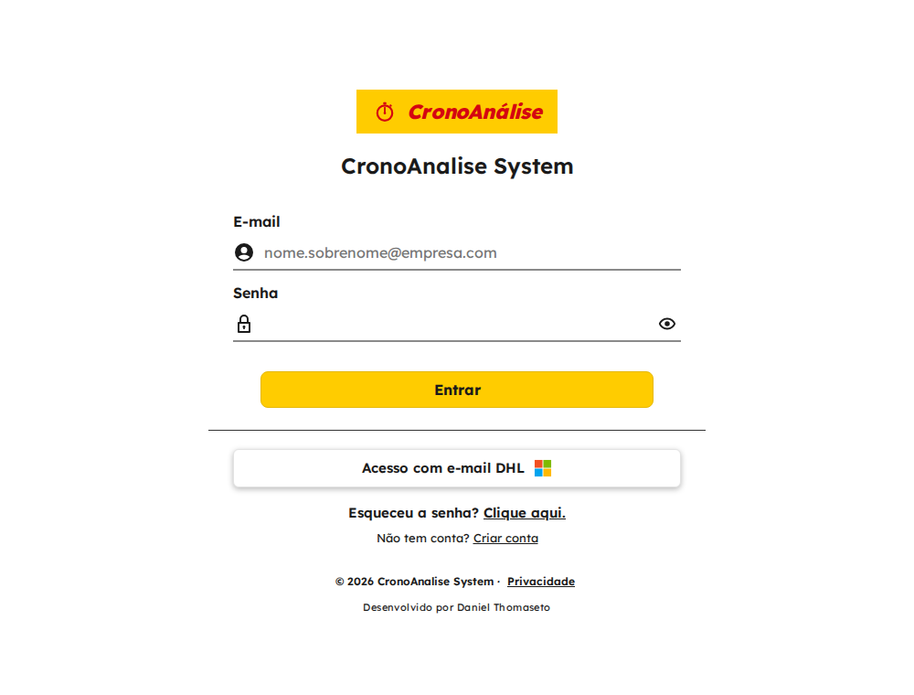

### Opção A: com a conta Microsoft da empresa (recomendado)

1. Abra o aplicativo no navegador do computador ou do celular.
2. Toque em **"Acesso com e-mail DHL"** (o botão com o logo da Microsoft).
3. Entre com o seu e-mail e a sua senha corporativos na página da Microsoft.
4. Pronto: você volta para o CronoAnalise já conectado.

> Se aparecer "O acesso com a conta Microsoft ainda não foi ativado pelo administrador", use a opção B ou fale com quem administra o sistema (veja a [seção 19](#19-configuração-inicial-para-quem-administra-o-sistema)).

### Opção B: com e-mail e senha

1. Digite o **E-mail** e a **Senha**. O ícone de olho mostra ou esconde a senha.
2. Toque em **Entrar**.
3. Primeira vez? Toque em **"Não tem conta? Criar conta"**, use o e-mail e a senha escolhidos (mínimo 6 caracteres) e confirme pelo link que chega no e-mail.
4. Esqueceu a senha? Digite o e-mail e toque em **"Esqueceu a senha? Clique aqui."**. Chega um link para criar uma senha nova.

### Se a sua conta tem verificação em duas etapas

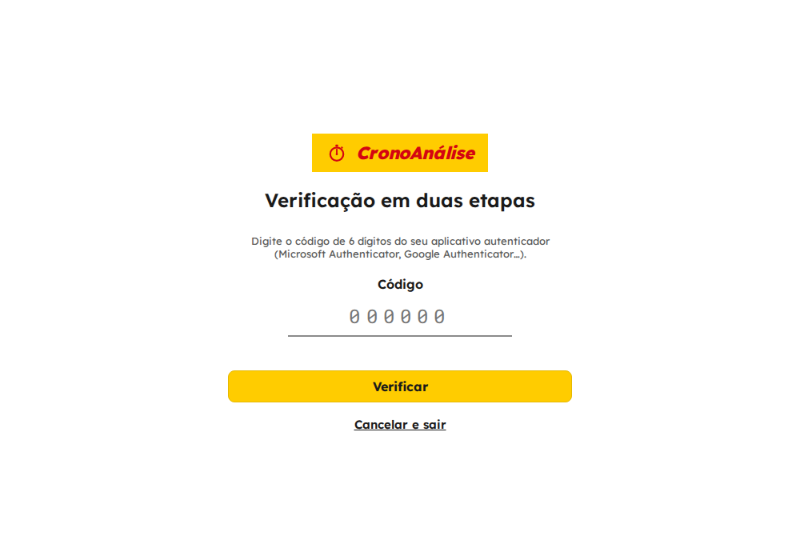

1. Depois do e-mail e da senha, o sistema pede o **código de 6 dígitos**.
2. Abra o aplicativo autenticador do celular (Microsoft Authenticator, Google Authenticator…).
3. Digite o código que aparece para "CronoAnálise" e toque em **Verificar**. (**Cancelar e sair** volta para o login.)

> Código recusado? Confira se o relógio do celular está no horário automático e use o código atual (ele muda a cada 30 s).

---

## 2. Conhecer a tela inicial (Dashboard)

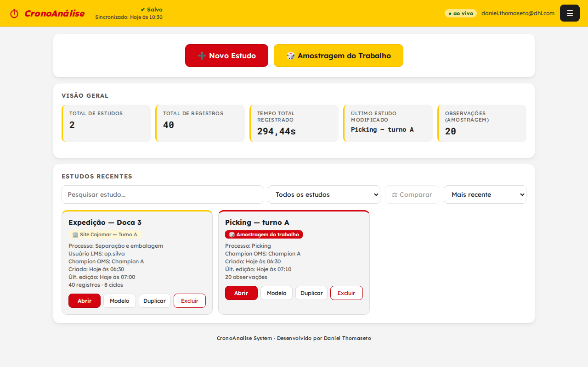

| Área | Para que serve |
|---|---|
| **Barra amarela** | Situação da sincronização ("✔ Salvo", "Sincronizando…", "Offline — salvo neste aparelho"), selo **"● ao vivo"** (tempo real ligado), seu e-mail e o **menu ☰** |
| **➕ Novo Estudo** | Cria um estudo de cronoanálise (cronômetro por etapa) |
| **🎲 Amostragem do Trabalho** | Cria um estudo de amostragem (observações em horários aleatórios) |
| **Visão Geral** | Totais de estudos, registros, tempo e observações |
| **Estudos Recentes** | Busca, filtro (todos, meus, compartilhados comigo, por time), **⚖ Comparar** e ordenação |

Em cada cartão de estudo:

| Botão | O que faz |
|---|---|
| **Abrir** | Abre o estudo |
| **Modelo** | Cria um estudo **novo** com as mesmas etapas e parâmetros, sem registros. Ideal para repetir a medição no mesmo processo |
| **Duplicar** | Cria uma cópia completa, com registros |
| **Excluir** | Apaga o estudo. Só o dono exclui; quem recebeu o estudo compartilhado vê **Sair** |

O selo 🏢 no cartão indica o **time** com quem o estudo foi compartilhado.

---

## 3. Criar um estudo de cronoanálise

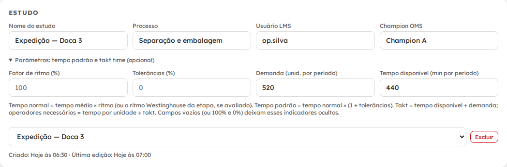

1. No Dashboard, toque em **➕ Novo Estudo**.
2. Preencha o painel **Estudo**:
   - **Nome do estudo** (ex.: "Expedição — Doca 3");
   - **Processo** (ex.: "Separação e embalagem");
   - **Usuário LMS**: quem executa o processo;
   - **Champion OMS**: quem conduz o estudo.
3. Opcional: abra **"Parâmetros: tempo padrão e takt time"** e preencha:
   - **Fator de ritmo (%)**: 100 = ritmo normal;
   - **Tolerâncias (%)**: fadiga e necessidades pessoais (ex.: 15);
   - **Demanda**: unidades por período (ex.: 520 por turno);
   - **Tempo disponível**: minutos por período (ex.: 440). Com demanda e tempo disponível, o sistema calcula o **takt time**.
4. Tudo é salvo sozinho, no aparelho e na nuvem. Não existe botão "Salvar" obrigatório.

> A caixa de seleção no fim do painel troca rapidamente entre estudos. **Excluir** apaga o estudo aberto.

---

## 4. Cadastrar as etapas do processo

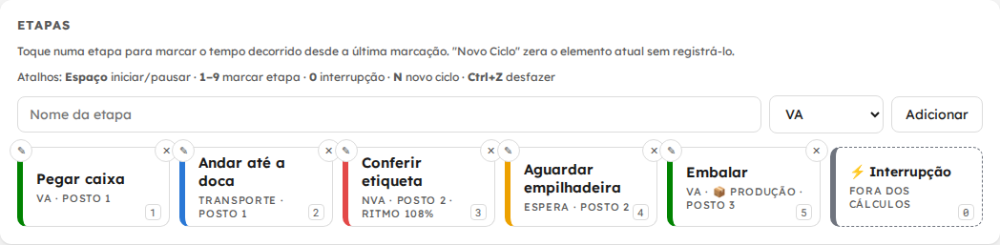

1. No painel **Etapas**, digite o **nome da etapa** (ex.: "Pegar caixa").
2. Escolha o **tipo**:

   | Tipo | Quando usar |
   |---|---|
   | **VA** (valor agregado) | A etapa transforma o produto/serviço |
   | **NVA** (não agrega valor) | Necessária, mas não transforma (ex.: conferir) |
   | **Espera** | Tempo parado aguardando algo |
   | **Transporte** | Movimentação de material, produto ou pessoas |

3. Toque em **Adicionar**. Repita para cada etapa, **na ordem do processo**.
4. Para mudar uma etapa, toque no **✎** do cartão:

   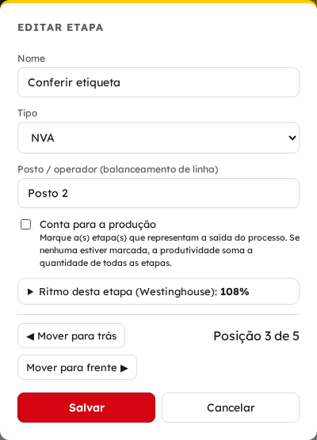

   - **Nome** e **Tipo**;
   - **Posto / operador**: para o balanceamento de linha ([seção 10](#10-balancear-a-linha));
   - **Conta para a produção**: marque nas etapas que representam a saída do processo (ex.: "Embalar"). Assim a produtividade conta só essas unidades;
   - **Ritmo desta etapa (Westinghouse)**: veja a [seção 9](#9-ritmo-westinghouse-e-tempo-padrão);
   - **◀ Mover para trás / Mover para frente ▶**: muda a posição da etapa.
5. Para remover uma etapa, toque no **✕** do cartão. Os registros já feitos continuam.

> O cartão cinza **⚡ Interrupção** fica sempre no fim. Ele serve para eventos fora do processo (ver [seção 5](#5-cronometrar)).

---

## 5. Cronometrar

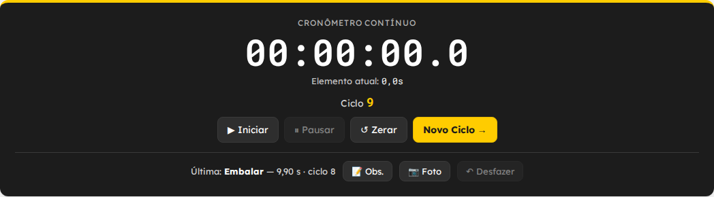

**Como funciona:** o cronômetro corre sem parar. Cada toque numa etapa grava o tempo **desde a última marcação**. Você toca na etapa **quando ela termina**.

1. Toque em **▶ Iniciar** quando o operador começar o ciclo.
2. A cada etapa concluída, toque no **cartão da etapa** correspondente. O tempo aparece em "Última: …".
3. Terminou o ciclo? Toque em **Novo Ciclo →**. O contador de ciclo avança, e o tempo entre a última etapa e o novo ciclo **não** é gravado.
4. Aconteceu algo estranho ao processo (uma conversa, uma ligação, uma falta de energia)? Toque em **⚡ Interrupção**. O tempo é gravado à parte e **não entra nos cálculos**.
5. **⏸ Pausar** congela o cronômetro; **↺ Zerar** recomeça do zero.
6. Errou? **↶ Desfazer** volta a última ação (marcação, novo ciclo, zerar ou exclusão).

### Quantidade

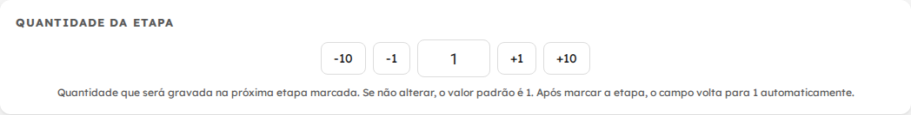

Se uma etapa processa mais de uma unidade (ex.: 3 caixas de uma vez), ajuste a **Quantidade da Etapa** com −10, −1, +1 e +10 (ou digite) **antes** de tocar na etapa. Depois da marcação, a quantidade volta para 1.

> **Dicas:**
> - Pode recarregar a página, trocar de aba ou bloquear o celular: o cronômetro **continua contando**.
> - Faça pelo menos o número de **ciclos necessários** que o sistema indica (coluna "n nec." dos indicadores). O ✓ aparece quando a amostra é suficiente.
> - No computador, use o teclado: `Espaço` inicia/pausa, `1`–`9` marcam as etapas, `0` é interrupção e `N` é novo ciclo.

---

## 6. Usar o Modo Campo no celular

| Celular em pé | Celular deitado |
|---|---|
| 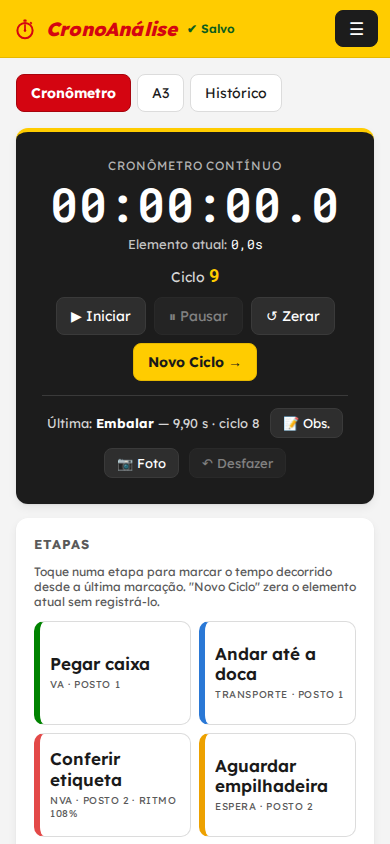 | 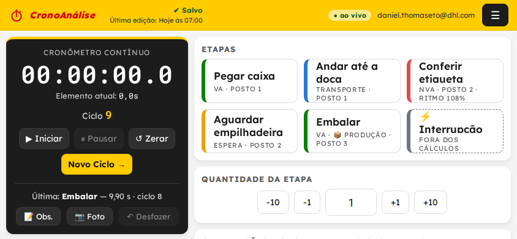 |

1. Abra o estudo e toque em **☰ → Modo Campo**.
2. A tela mostra só o essencial: cronômetro grande, etapas com botões grandes, quantidade e observações.
3. Deitado, as etapas ficam ao lado do cronômetro, para usar com as duas mãos.
4. Para voltar ao modo completo, toque em **☰ → Modo Campo** de novo.

> Sem internet no chão de fábrica? Pode cronometrar normalmente. Tudo fica salvo no aparelho e sobe sozinho quando a conexão voltar ("📴 Offline — salvo neste aparelho").

---

## 7. Corrigir registros, anotar e fotografar

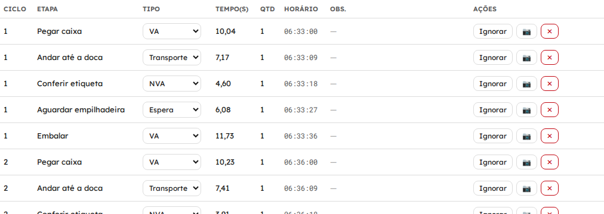

Na tabela **Registros**:

| Ação | Como fazer |
|---|---|
| Corrigir um tempo | Toque no tempo e digite o valor certo |
| Anotar no registro | Toque na coluna **Obs.** e escreva |
| Mudar o tipo | Escolha na lista da linha |
| **Ignorar** | Mantém o registro, mas tira dos cálculos (ex.: medição duvidosa). Toque de novo para incluir |
| **📷** | Tira ou anexa uma foto àquele registro |
| **✕** | Exclui o registro (dá para desfazer) |

- Tempos marcados com **⚠** estão fora de ±2 desvios da média da etapa. Confira se não foi um toque errado.
- **Observação do último registro:** no cronômetro, toque em **📝 Obs.** e escreva (ex.: "operador procurou etiqueta").
- **Foto do último registro:** toque em **📷 Foto**. No celular, abre a câmera.
- **Observações / Oportunidades Observadas:** a caixa de texto no fim da tela, para anotar desvios e ideias de melhoria do estudo todo. Ela entra no PDF e no Excel.

### Galeria de fotos

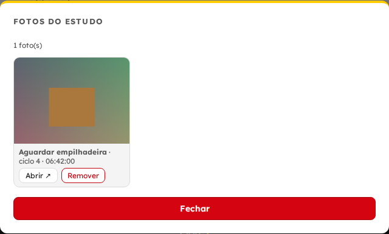

**☰ → 📷 Fotos do estudo** mostra todas as fotos, com o ciclo e a etapa. As fotos funcionam offline e sobem quando houver conexão. Toque em **Abrir ↗** para ver no tamanho original.

---

## 8. Ler os indicadores e gráficos

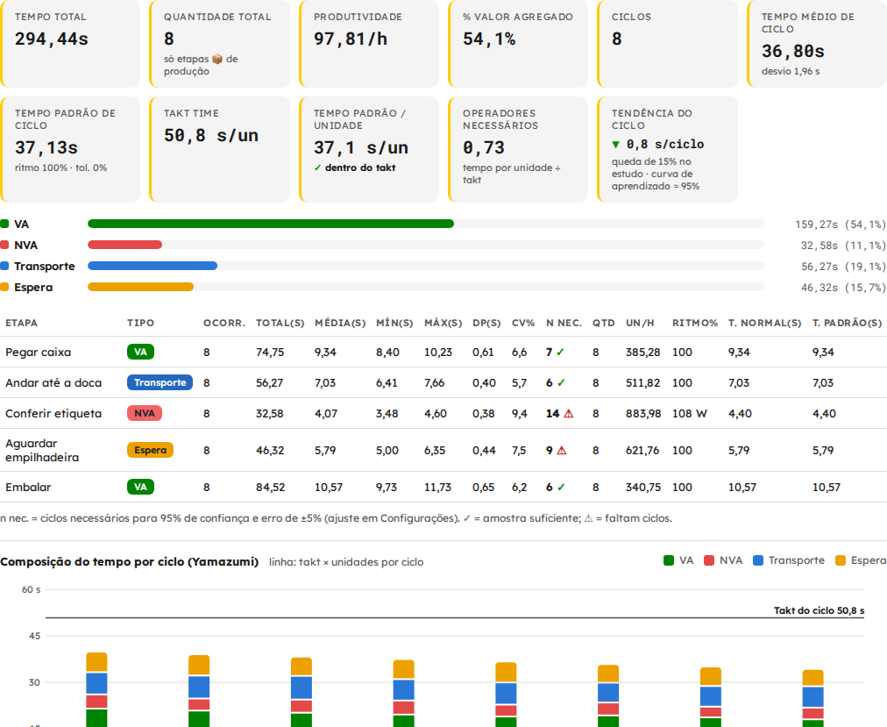

| Indicador | Significado |
|---|---|
| **Tempo total** | Soma dos tempos (sem interrupções nem registros ignorados) |
| **Quantidade total** | Unidades produzidas (só das etapas "de produção", se houver) |
| **Produtividade** | Unidades por hora |
| **% Valor Agregado** | Parte do tempo gasta em etapas VA |
| **Ciclos** / **Tempo médio de ciclo** | Quantos ciclos e a média (com o desvio) |
| **Tempo padrão de ciclo** | Com ritmo e tolerâncias aplicados |
| **Takt time** | Ritmo exigido pela demanda (tempo disponível ÷ demanda) |
| **Tempo padrão / unidade** | Comparado com o takt: "✓ dentro do takt" ou acima |
| **Operadores necessários** | Tempo por unidade ÷ takt |
| **Tendência do ciclo** | Se o ciclo está caindo ou subindo de forma significativa, e a **curva de aprendizado** (ex.: 95% = a cada vez que a quantidade dobra, o tempo cai 5%) |

Abaixo dos cartões:

- **Barras por tipo** (VA, NVA, Transporte, Espera), com segundos e %.
- **Resumo por etapa:** ocorrências, total, média, mínimo, máximo, desvio padrão, CV%, **n nec.** (ciclos necessários; ✓ suficiente, ⚠ faltam), quantidade, un/h, ritmo, tempo normal e tempo padrão.

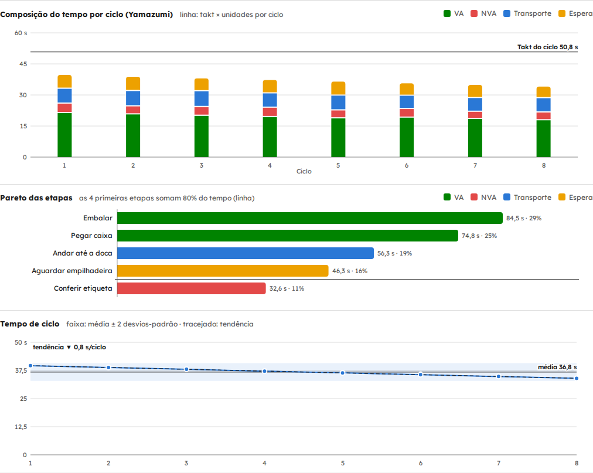

| Gráfico | Como ler |
|---|---|
| **Yamazumi** | Cada barra é um ciclo, empilhado por tipo. A linha é o takt do ciclo: barras acima dela não atendem à demanda |
| **Pareto** | Etapas da que mais consome tempo para a que menos. Ataque primeiro as do topo |
| **Tempo de ciclo** | Evolução ciclo a ciclo, com média, faixa ±2σ e tendência (tracejada) |

Passe o mouse (ou toque) nas barras e pontos para ver os valores.

---

## 9. Ritmo Westinghouse e tempo padrão

O **tempo normal** corrige o tempo medido pelo ritmo do operador, e o **tempo padrão** acrescenta as tolerâncias.

1. Para um ritmo único no estudo todo, use o **Fator de ritmo (%)** nos parâmetros do estudo.
2. Para avaliar **cada etapa**, toque no **✎** da etapa → **Ritmo desta etapa (Westinghouse)**.
3. Escolha o nível de cada fator:

   | Fator | Faixa |
   |---|---|
   | Habilidade | A1 Superior (+15%) … D Média (0) … F2 Fraca (−22%) |
   | Esforço | A1 Excessivo (+13%) … D Médio (0) … F2 Fraco (−17%) |
   | Condições | A Ideais (+6%) … D Médias (0) … F Ruins (−7%) |
   | Consistência | A Perfeita (+4%) … D Média (0) … F Ruim (−4%) |

4. O ritmo da etapa aparece no cartão (ex.: "RITMO 108%") e na coluna **Ritmo%** com "W". Ele substitui o ritmo geral naquela etapa.
5. Informe as **Tolerâncias (%)** nos parâmetros para obter o tempo padrão.

---

## 10. Balancear a linha

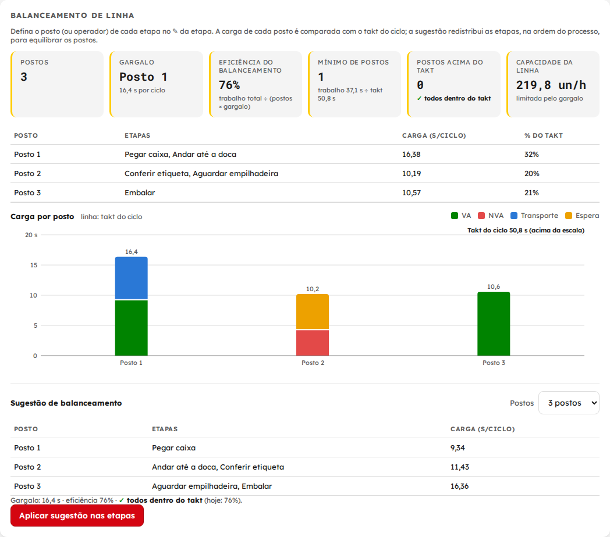

1. Em cada etapa (**✎**), preencha o **Posto / operador** (ex.: "Posto 1", "Posto 2").
2. Preencha **Demanda** e **Tempo disponível** nos parâmetros, para ter o takt.
3. O painel **Balanceamento de linha** mostra:
   - a **carga de cada posto** (segundos por ciclo) e a % do takt;
   - o **gargalo** (posto mais carregado);
   - a **eficiência do balanceamento** (quanto mais perto de 100%, mais equilibrado);
   - o **mínimo teórico de postos** e os postos **acima do takt**;
   - a **capacidade da linha** (unidades por hora, limitada pelo gargalo);
   - o gráfico **Carga por posto**, com a linha do takt.
4. Em **Sugestão de balanceamento**, escolha quantos postos quer. O sistema redistribui as etapas, **mantendo a ordem do processo**, para equilibrar a carga.
5. Gostou? Toque em **Aplicar sugestão nas etapas**. O posto de cada etapa é atualizado.

---

## 11. Fazer uma amostragem do trabalho

Use a amostragem para estimar **quanto do tempo é produtivo** (e onde está o resto) sem cronometrar etapa por etapa. O observador olha a operação em **horários aleatórios** e anota o que está acontecendo naquele instante.

### Passo 1: criar o estudo

No Dashboard, toque em **🎲 Amostragem do Trabalho** e preencha nome, processo e as demais informações.

### Passo 2: definir o roteiro

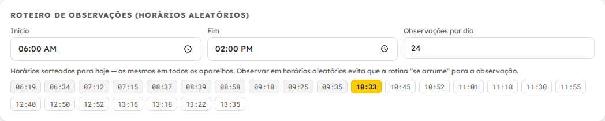

1. Em **Roteiro de observações**, informe **Início**, **Fim** e **Observações por dia**.
2. O sistema sorteia os horários do dia. **Todos os aparelhos veem os mesmos horários**, e eles mudam a cada dia.
3. Horários já passados ficam riscados, e o próximo fica destacado em amarelo.

### Passo 3: ajustar as categorias

No painel **Categorias**, adicione o que faz sentido no seu processo (ex.: "Aguardando empilhadeira") e marque **Produtiva** quando for o caso. As categorias iniciais são: Produtivo, Aguardando/ocioso, Deslocamento, Falta de material e Ausente.

### Passo 4: observar

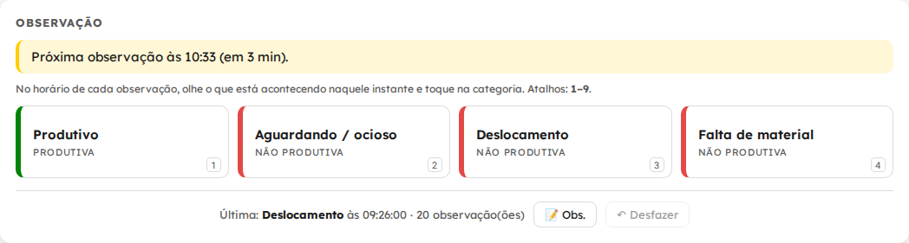

1. A faixa amarela avisa a **próxima observação**. Na hora, aparece **"⏰ Hora de observar"**, e o celular vibra.
2. Olhe a operação **naquele instante** e toque na **categoria** (ou tecle `1`–`9`).
3. **📝 Obs.** acrescenta um comentário à última observação; **↶ Desfazer** remove a última.

### Passo 5: ler os resultados

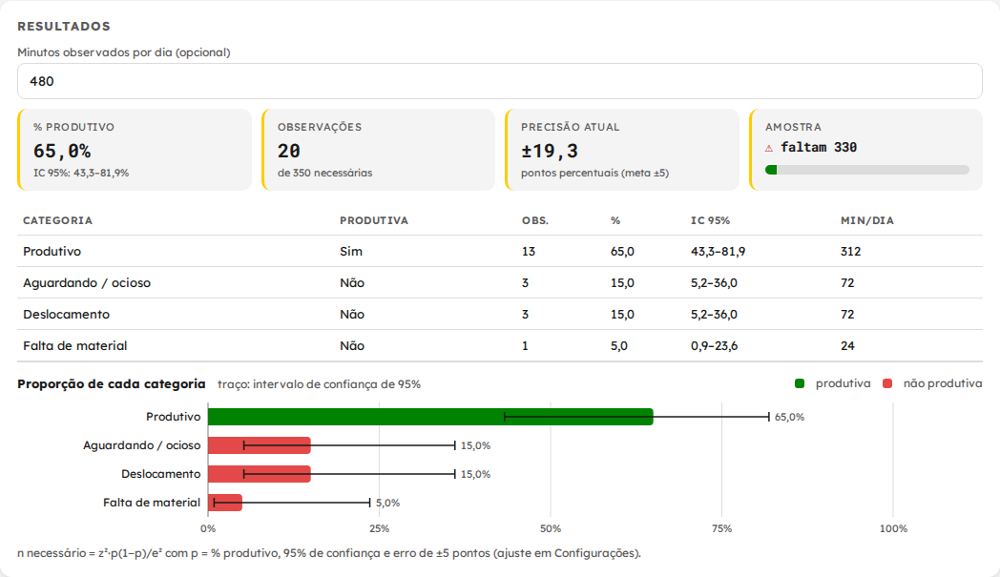

| Resultado | Significado |
|---|---|
| **% Produtivo** | Estimativa da fração de tempo produtivo, com o **intervalo de confiança** (IC 95%) |
| **Observações** | Quantas foram feitas e quantas são **necessárias** para a precisão desejada |
| **Precisão atual** | ± pontos percentuais da estimativa (meta em Configurações, padrão ±5) |
| **Amostra** | Barra de progresso até o número necessário |
| **Tabela por categoria** | Observações, %, intervalo de confiança e **minutos por dia** (preencha "Minutos observados por dia", ex.: 480) |

O gráfico mostra a proporção de cada categoria e o traço do intervalo de confiança: quanto menor o traço, mais precisa a estimativa.

---

## 12. Relatório A3

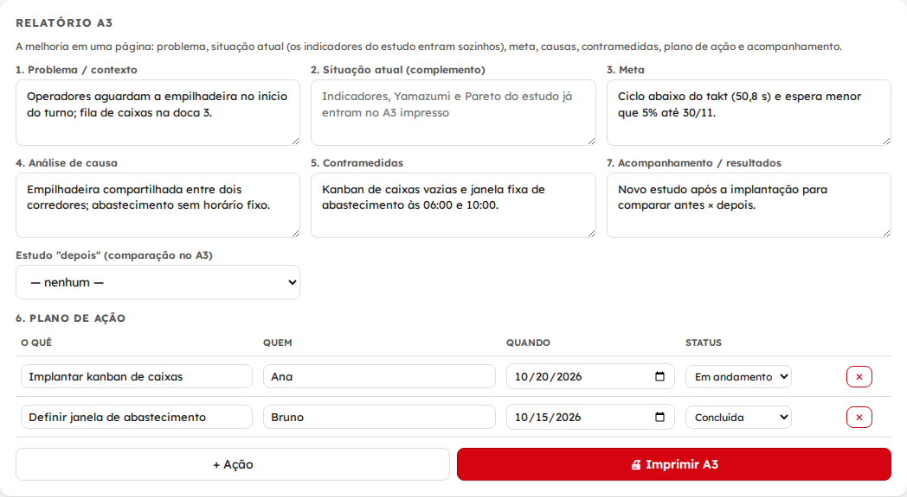

1. No estudo, toque na aba **A3**.
2. Preencha os blocos:
   1. **Problema / contexto**
   2. **Situação atual** (os indicadores, o Yamazumi e o Pareto entram sozinhos; escreva só o complemento)
   3. **Meta**
   4. **Análise de causa** (5 porquês, Ishikawa…)
   5. **Contramedidas**
   6. **Plano de ação**: toque em **+ Ação** e preencha o quê, quem, quando e o status (Aberta, Em andamento, Concluída)
   7. **Acompanhamento / resultados**
3. Opcional: escolha o **Estudo "depois"**. O A3 mostra a comparação antes × depois.
4. Toque em **🖨 Imprimir A3**. Escolha a impressora ou **Salvar como PDF**; o formato **A3 paisagem** já vem configurado.

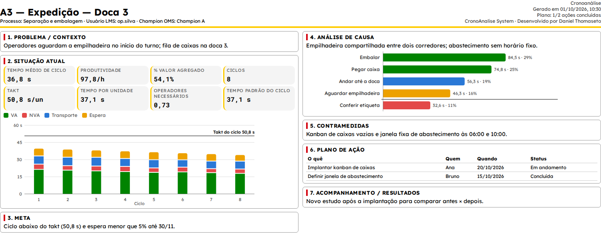

---

## 13. Exportar: Excel, CSV, PDF, OneDrive e envio

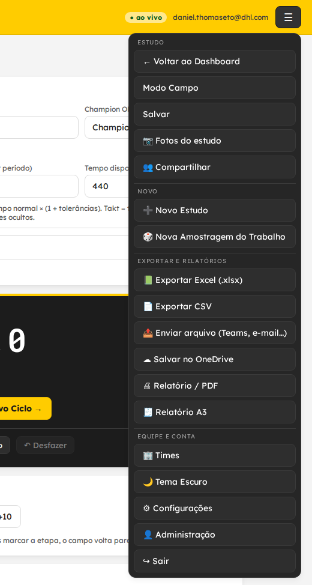

Com o estudo aberto, toque em **☰** e escolha:

| Opção | Resultado |
|---|---|
| **📗 Exportar Excel (.xlsx)** | Planilha com as abas Resumo, Registros, Por etapa, Por ciclo, Pareto, Balanceamento, A3 e Observações (na amostragem: Resumo, Por categoria e Observações) |
| **📄 Exportar CSV** | Arquivo simples que abre direto no Excel em português |
| **📤 Enviar arquivo (Teams, e-mail…)** | No celular, abre a lista de apps (Teams, Outlook, WhatsApp, OneDrive…) com a planilha anexada |
| **☁ Salvar no OneDrive** | Salva a planilha na pasta **CronoAnalise** do seu OneDrive e oferece abrir no Excel Online. Na primeira vez, a Microsoft pede permissão para o app salvar arquivos |
| **🖨 Relatório / PDF** | Relatório para imprimir ou salvar em PDF, com indicadores, gráficos, tabelas e observações |
| **🧾 Relatório A3** | Imprime o A3 ([seção 12](#12-relatório-a3)) |

> "Salvar no OneDrive" só aparece funcionando para quem entrou com a **conta Microsoft**.

---

## 14. Comparar antes × depois

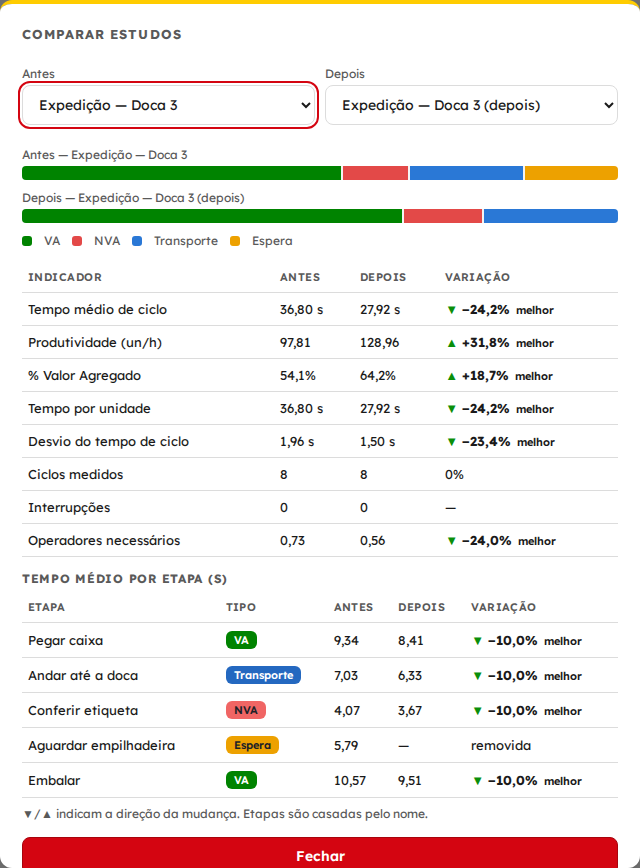

1. No Dashboard, toque em **⚖ Comparar**.
2. Escolha o estudo **Antes** e o estudo **Depois**.
3. Veja:
   - a composição do tempo por tipo, lado a lado;
   - os indicadores (tempo de ciclo, produtividade, % VA, tempo por unidade, desvio, interrupções…), com a **variação** (▲/▼ e a palavra "melhor" ou "pior");
   - a média de cada etapa, indicando etapas **novas** e **removidas**.

> Para comparar, crie o estudo "depois" a partir do botão **Modelo** do estudo "antes": as etapas ficam com os mesmos nomes.

---

## 15. Compartilhar com pessoas e times

### Compartilhar um estudo

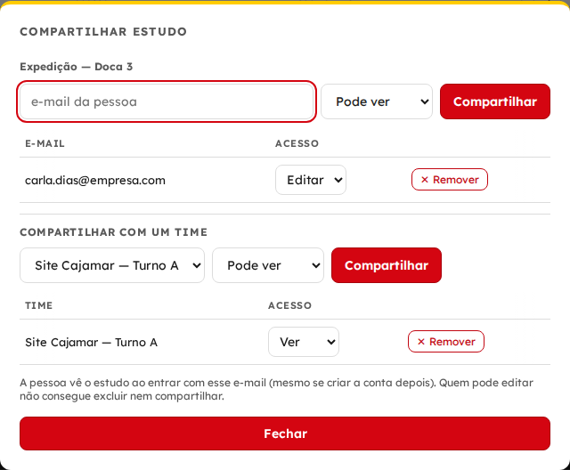

1. Abra o estudo e toque em **☰ → 👥 Compartilhar** (só o dono vê essa opção).
2. Digite o **e-mail da pessoa** e escolha **Pode ver** ou **Pode editar**. Toque em **Compartilhar**.
3. Para dar acesso a um grupo, use **Compartilhar com um time**.
4. Para mudar o acesso, use a lista na linha; para tirar o acesso, toque em **✕ Remover**.

A pessoa vê o estudo ao entrar com aquele e-mail, mesmo que crie a conta depois. Quem pode editar não consegue excluir nem compartilhar o estudo.

### Criar e gerenciar times

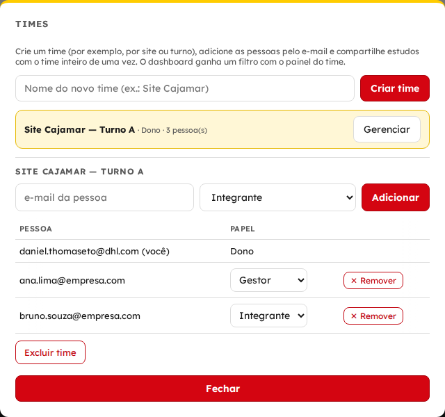

1. Toque em **☰ → 🏢 Times**.
2. Digite o nome (ex.: "Site Cajamar — Turno A") e crie o time.
3. Toque em **Gerenciar** e adicione as pessoas pelo e-mail, como **Integrante** ou **Gestor**.

   | Papel | Pode |
   |---|---|
   | **Dono** | Tudo, inclusive excluir o time |
   | **Gestor** | Adicionar e remover pessoas e mudar papéis |
   | **Integrante** | Ver os estudos compartilhados com o time |

4. Quem entra no time depois recebe acesso automaticamente a todos os estudos compartilhados com ele.

### Painel do time

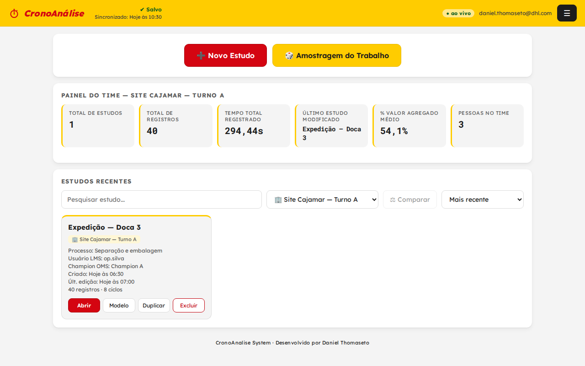

No Dashboard, escolha o time no filtro de estudos. A **Visão Geral** passa a mostrar os números somados dos estudos daquele time.

### Acompanhar ao vivo

Com o selo **"● ao vivo"**, quem estiver com o mesmo estudo aberto vê as marcações chegando em poucos segundos. É útil para o líder acompanhar a coleta do escritório.

---

## 16. Histórico e versões

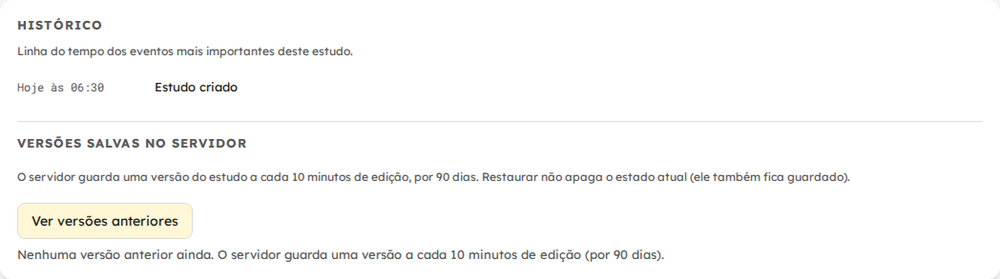

1. No estudo, toque na aba **Histórico**.
2. A **linha do tempo** mostra os eventos importantes: criação, etapas adicionadas ou alteradas, registros excluídos, fotos, balanceamento aplicado, exportações…
3. Em **Versões salvas no servidor**, toque em **Ver versões anteriores**. O servidor guarda uma versão a cada 10 minutos de edição, por 90 dias.
4. Toque em **Restaurar** numa versão para voltar a ela. O estado atual também fica guardado, então nada se perde.

---

## 17. Configurações, segurança e backup

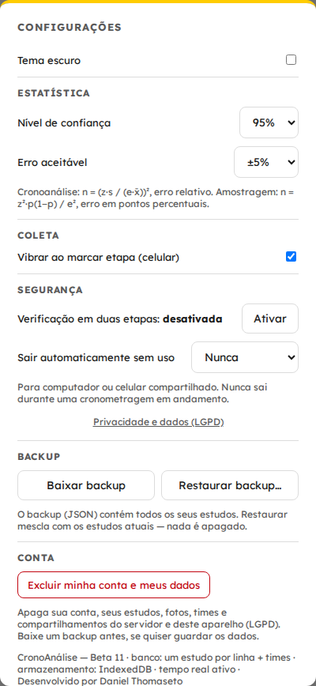

Toque em **☰ → ⚙ Configurações**:

| Opção | Para que serve |
|---|---|
| **Tema escuro** | Liga o tema escuro (também no menu) |
| **Nível de confiança** / **Erro aceitável** | Usados no número de ciclos e de observações necessários (padrão 95% e ±5%) |
| **Vibrar ao marcar etapa** | Retorno tátil no celular |
| **Verificação em duas etapas** | Ativa ou desativa o código do autenticador (ver abaixo) |
| **Sair automaticamente sem uso** | Para computador ou celular compartilhado: 15 min, 30 min, 1 h ou 2 h. Antes de sair, avisa com 60 s de contagem. Nunca sai com o cronômetro rodando |
| **Privacidade e dados (LGPD)** | O que é guardado e por quanto tempo |
| **Baixar backup** / **Restaurar backup** | Arquivo com todos os seus estudos. Restaurar **soma** aos estudos atuais, sem apagar nada |
| **Excluir minha conta e meus dados** | Apaga conta, estudos, fotos, times e compartilhamentos do servidor e do aparelho (digite EXCLUIR para confirmar) |

### Ativar a verificação em duas etapas

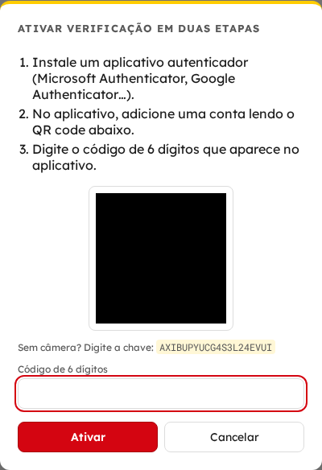

1. Em **Configurações**, toque em **Ativar**.
2. No aplicativo autenticador do celular, escaneie o **QR code** (ou digite o código em texto).
3. Digite o código de 6 dígitos que aparece no app e confirme.
4. A partir de agora, cada login pede o código ([seção 1](#se-a-sua-conta-tem-verificação-em-duas-etapas)).

### Tema escuro

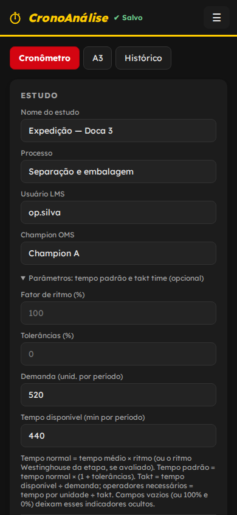

### Instalar como aplicativo

- **Celular:** no navegador, toque em "Adicionar à tela inicial" (Android: menu ⋮; iPhone: botão Compartilhar).
- **Computador:** clique no ícone de instalar na barra de endereço do Chrome ou do Edge.

O app instalado abre em tela cheia e funciona offline.

---

## 18. Administração (somente administradores)

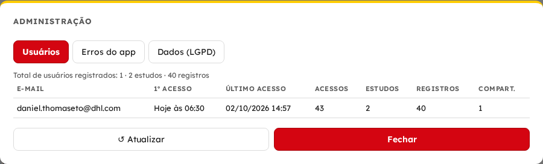

**☰ → Administração** (visível só para e-mails cadastrados como administradores):

| Aba | Conteúdo |
|---|---|
| **Usuários** | Quem usa o sistema: primeiro e último acesso, número de acessos, estudos, registros e compartilhamentos |
| **Erros** | Erros que aconteceram no app dos usuários (sem dados pessoais), para corrigir problemas. **Limpar** apaga a lista |
| **Dados** | Política de retenção (LGPD) e o botão para aplicar a limpeza agora |

Para adicionar outro administrador, inclua o e-mail na tabela `crono_admins` do Supabase (Table Editor).

---

## 19. Configuração inicial (para quem administra o sistema)

Feito uma única vez. Detalhes técnicos também no [README](../README.md).

### 19.1 Banco de dados (Supabase)

1. Entre no [Supabase](https://supabase.com) → projeto do CronoAnalise → **SQL Editor** → **New query**.
2. Cole e rode, nesta ordem (todos podem rodar de novo sem problema):
   1. `supabase/schema.sql`
   2. `supabase/migrations/002_estudos_por_linha.sql`
   3. `supabase/migrations/003_equipe_seguranca.sql`
3. **Limpeza automática (LGPD, opcional):** **Database → Extensions → pg_cron → Enable**. Depois rode a 003 de novo, para agendar a limpeza diária.
4. **Recuperação de senha:** em **Authentication → URL Configuration**, coloque `https://crono-analise.vercel.app` em *Site URL* (ou em *Redirect URLs*).

### 19.2 Login com a conta Microsoft

1. No [portal do Azure](https://portal.azure.com) → **Microsoft Entra ID → App registrations → New registration**:
   - nome: "CronoAnalise System";
   - tipo de conta: só deste diretório;
   - *Redirect URI* (Web): `https://zwfnsknaxqnexeuzvvjn.supabase.co/auth/v1/callback`.
2. **Certificates & secrets → New client secret**. Copie o valor; ele só aparece uma vez.
3. **Token configuration → Add optional claim → ID → email**.
4. Para o OneDrive: **API permissions → Add → Microsoft Graph → Delegated → Files.ReadWrite** (se necessário, **Grant admin consent**).
5. No Supabase → **Authentication → Providers → Azure**: ative e cole:
   - o *Application (client) ID*;
   - o *secret*;
   - o *Azure Tenant URL* `https://login.microsoftonline.com/<ID do diretório>`.
6. Em **Authentication → URL Configuration → Redirect URLs**, inclua `https://crono-analise.vercel.app`.

### 19.3 Marca

Em `js/config.js` (`BRAND`), é possível mudar:

- o título da tela de login;
- o texto do botão Microsoft;
- o rodapé;
- o logo: para usar o logo oficial, salve o arquivo do portal de marca em `icons/` e preencha `BRAND.logo`.

---

## 20. Perguntas frequentes e solução de problemas

| Situação | O que fazer |
|---|---|
| "📴 Offline — salvo neste aparelho" | Normal sem internet. Continue trabalhando; tudo sobe quando a conexão voltar |
| "⚠ Erro ao sincronizar" | Os dados estão salvos no aparelho. O sistema tenta de novo sozinho; se persistir, recarregue a página e entre de novo |
| Duas pessoas editaram o mesmo estudo | O sistema **junta** as alterações registro a registro, e nenhuma marcação se perde |
| Apaguei algo sem querer | Use **↶ Desfazer**; ou a aba **Histórico → Versões salvas no servidor**; ou o **backup** |
| O código de duas etapas não funciona | Ajuste o relógio do celular para automático e use o código atual |
| Perdi o celular com o autenticador | Peça ao administrador para remover o fator em *Supabase → Authentication → Users* |
| "Salvar no OneDrive" pede login de novo | A permissão da Microsoft vale cerca de 1 h; entre de novo e a exportação continua sozinha |
| A foto não aparece para o colega | Ela sobe quando o seu aparelho tiver conexão. Até lá, fica só no seu aparelho |
| O sistema saiu sozinho | A opção "Sair automaticamente sem uso" está ligada nas Configurações |
| O cronômetro "sumiu" ao recarregar | Não sumiu: ele continua contando. Abra o mesmo estudo |
| Quero o app instalado no celular | Veja "Instalar como aplicativo" na [seção 17](#instalar-como-aplicativo) |

---

## 21. Atalhos de teclado

| Tecla | Cronoanálise | Amostragem |
|---|---|---|
| `Espaço` | Iniciar / pausar | — |
| `1` a `9` | Marcar a etapa 1 a 9 | Registrar a categoria 1 a 9 |
| `0` | Interrupção | — |
| `N` | Novo ciclo | — |
| `Ctrl` + `Z` | Desfazer | Desfazer |
| `Esc` | Fechar janela | Fechar janela |

---

CronoAnalise System · Desenvolvido por Daniel Thomaseto · As imagens deste guia são geradas automaticamente com dados de demonstração (`npm run docs:screenshots`).
